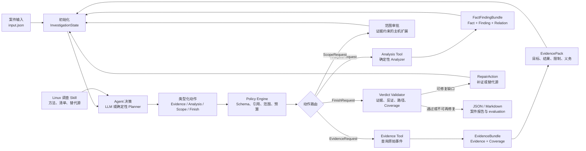

# Linux 未知文件威胁研判 Agent：当前完整实现说明（P2.5）

## 1. 项目目标与当前定位

本项目接收 Linux 检测系统产生的未知文件告警，围绕文件来源、是否执行、运行行为、持久化、网络活动和实际影响持续补证，最终输出带证据引用的威胁类型、攻击路径、实际影响、反证和局限性。

当前版本不是“让 LLM 自由写一份分析报告”，而是一个可审计的混合 Agent：

- LLM 负责理解案件状态、选择下一项合法调查、提出受控场景激活或跨主机范围申请，并可给出引用 Fact/Finding 的案件解释。
- Evidence Tool 只从数据源查询并返回原始证据与 Coverage。
- Analysis Tool 使用确定性规则把证据转成 Fact、Finding 和 Relation。
- Policy Engine、状态机和 Verdict Validator 控制权限、引用、预算、收敛与结论门槛。
- Skill 提供 Linux 调查顺序、证据清单、替代数据源和停止条件，但不伪造证据或替代 Analyzer。

## 2. 总体架构



## 3. 一轮调查如何运行

1. `ingestion.py` 读取告警字段和 `Detail` 进程链，规范化时间、Hash、路径、主机和实体。
2. 初始化 `InvestigationState`，将告警材料区分为上游 Claim 与已知实体；告警本身不直接变成恶意 Finding。
3. Planner 读取裁剪后的状态、调查 Skill 和动态 Tool Catalog，输出一个类型化动作。
4. `policy.py` 检查动作 Schema、Gap、工具类型、证据引用、Scope、重复调用和预算。
5. Evidence Tool 查询 JSONL Repository；每次响应写入 Evidence、Coverage、ToolCall、AnalysisObligation 和 EvidencePack。
6. 就绪的 AnalysisObligation 优先执行；Analyzer 仅能读取请求授权的 Evidence ID。
7. Fact/Finding/Relation 写回状态，相关 Gap 和 Evidence Role 随确定性结果更新。
8. Agent 继续补证、做分析、申请范围或请求结束。
9. Verdict Validator 检查结论引用、关键角色、反证、数据覆盖和路径边；可修复时生成 RepairAction 并重开 Gap。
10. 通过验证后生成报告；证据不足也会以明确局限结案，而不是强行判黑。

## 4. 核心状态对象

| 对象 | 含义 | 谁可以创建 |
|---|---|---|
| `Entity` | 文件、进程、主机、IP、域名、服务等实体 | 初始化器、确定性执行层 |
| `Claim` | 告警或上游材料中的尚未独立确认的陈述 | 初始化器 |
| `Evidence` | 带来源、时间、原始引用和状态的原子证据 | Evidence Tool |
| `Fact` | 从证据直接确认的原子事实 | Analysis Tool |
| `Finding` | 规则识别出的安全行为或影响 | Analysis Tool |
| `Relation` | 有 Evidence 引用的攻击路径边 | Analysis Tool |
| `Hypothesis` | 当前待验证的攻击解释 | 初始化器或受控场景模板 |
| `EvidenceRole` | 一个假设必须获得的证据角色 | 受控场景模板 |
| `EvidenceGap` | 尚未回答的调查问题及推荐工具 | 初始化器或受控场景模板 |
| `Coverage` | 数据源是否存在、时间覆盖、完整性、截断和限制 | Repository / Tool |
| `AnalysisObligation` | 收到某类证据后必须执行的确定性分析 | 状态更新逻辑 |
| `ToolScore` | 某轮中候选 Tool 的可解释评分 | Orchestration |
| `EvidencePack` | 一次调查请求及其证据、覆盖、义务和局限 | Orchestration |
| `RepairAction` | 结构化、限次的修复计划 | Engine / Validator |
| `ScopeExpansion` | 跨主机申请、依据、审批和限制 | Policy / Engine |
| `Interpretation` | LLM 基于已有 Fact/Finding 的解释 | LLM，经引用校验后写入 |
| `CandidateVerdict` | 候选结论、支持/反证与限制 | 确定性 Verdict 逻辑 |

`Coverage` 不是“攻击是否绕过”。它描述我们能否看到相应数据。例如 `network=unavailable` 表示没有网络遥测，不能据此证明“没有外联”。

## 5. 四类调查动作

- `EvidenceRequest`：指定 `tool_name`、调查目标、目标 Gap 和过滤参数，获取新证据。
- `AnalysisRequest`：指定 Analyzer 和已有 Evidence ID，把原始证据转成 Fact/Finding/Relation。
- `ScopeRequest`：携带能直接指出候选主机的 Evidence ID，请求扩大主机、数据域和时间窗口。
- `FinishRequest`：申请结案；它本身不能决定 Verdict，仍必须经过确定性验证。

LLM 输出不合法时允许一次结构化修复；仍不合法则记录 denied ToolCall，而不是执行猜测出来的动作。

## 6. Tool 层实现

### 6.1 Evidence Tool

所有 Evidence Tool 使用统一查询接口，支持主机、实体、开始/结束时间、字段过滤和数量上限。当前主要类别为：

- 执行与进程：执行确认、父子链、子进程命令、登录会话、发现命令。
- 文件来源与活动：创建、下载、传输、解压、包安装、Web 上传、敏感文件读取。
- C2 与网络：进程外联、Socket I/O、DNS、HTTP 上传、传输字节。
- 持久化：systemd、cron。
- 窃密：敏感访问、归档、暂存目录、HTTPS/DNS 外发、合法传输基线。
- 勒索：批量修改、内容与熵变化、批量改名、备份/快照破坏、破坏命令、服务停止、勒索信、合法批处理基线。
- 跨主机：跨主机传输、Hash 存在、内网连接、远程登录、账号活动、共享外部端点、资产与部署上下文。
- 反证：软件包来源、批准端点、批准备份/同步、批准批处理和部署关系。

Evidence Tool 不返回“这是勒索”“这是 C2”之类答案，只返回事件和可见性。

### 6.2 Analysis Tool

Analysis Tool 与 Evidence Tool 统一注册，但具有 `kind=analysis`，由 Policy 限制输入。当前 Analyzer 覆盖：

- 执行、进程链、网络周期性、远程命令因果链、systemd 持久化、软件信誉与文件来源。
- 敏感发现、凭据访问、数据暂存、数据传输、DNS 隧道、HTTPS/DNS 窃密链。
- 批量文件影响、可能的文件加密、恢复抑制、勒索信、服务中断、勒索完整链。
- 跨主机线索与传播路径。

确定性规则的价值是可复现、可测试和可解释。例如“执行成功 + 敏感文件读取 + 明确归档成员关系 + 同一进程树传输该归档 + 未命中批准基线”才支持 HTTPS 窃密链；LLM 不能跳过这些门槛。

## 7. P2.5 的编排增强

### 7.1 ToolScore

候选工具不再只有静态优先级。评分由以下部分相加：Gap 优先级、Evidence Role 价值、假设信息增益、缺失证据增益、Coverage 预期、反证价值、实体适用性、Repair 优先级、重复惩罚、查询成本、跨范围成本和确定性分析义务。分数是建议，不会绕过 Policy。

### 7.2 EvidencePack

每次 EvidenceRequest 都形成 EvidencePack，记录“为什么查、查了哪里、返回了什么、数据是否完整、触发了哪些 Analyzer、有哪些限制”。这让多轮调查可以按任务包审计，而不只是查看散落 Evidence。

### 7.3 RepairAction

当前支持非法动作修复、缺失证据补查、替代数据源、Analyzer 输入补齐、Verdict 支撑修复、Scope 拒绝处理和预算收敛。Repair 有独立预算和尝试次数；Verdict 修复只执行本轮验证生成的修复项，避免误应用历史待办。

### 7.4 状态裁剪与收敛

给 LLM 的不是完整无限增长 State，而是相关 Evidence、最近 ToolCall、最近 EvidencePack、待处理 Repair、关键 Gap/Role 和 Top-12 Tool。确定性 Engine 仍保留完整状态。接近预算上限时会生成收敛动作，优先关键缺口并停止低价值查询。

## 8. 场景能力

- 后门/C2：执行归因、进程链、周期外联、入站数据到子进程命令再到响应的远控因果链、systemd 持久化和合法软件反证。
- 数据窃取：发现、敏感读取、归档/暂存、HTTPS 或 DNS 外发、传输量和批准备份/同步反证。
- 勒索：批量高频影响、内容/熵/文件头变化、扩展名改写、备份/快照破坏、服务中断、勒索信和合法批任务反证。
- 文件来源：下载、远程传输、归档释放、包安装、Web 上传等来源链。
- 跨主机：必须先有证据直接命名候选主机，再审批扩域；共享 C2 只能形成线索，不能单独证明传播。

场景模板允许 LLM 选择调查方向，但 Hypothesis/Role/Gap Schema 是经过审查的本地模板，LLM 不能任意发明业务状态结构。

## 9. 安全边界和结论验证

- 只读调查，不执行 Shell、隔离、删除、封禁等响应动作。
- 工具必须在 Registry 中，参数和引用必须合法。
- Analyzer 只读取明确授权的 Evidence ID。
- 跨主机最多三个候选主机，必须由已有 Evidence 直接指向，并受 Scope 预算和审批策略约束。
- 每条 Relation 必须引用存在的 Evidence，且两端 Entity 必须存在。
- 恶意 Verdict 必须满足相应场景证据角色和反证检查；Coverage 缺失会成为限制或导致证据不足。

## 10. 代码目录

```text
threat_agent/
  ingestion.py       输入规范化与初始状态
  models.py          全部 Pydantic 业务对象和动作 Schema
  scenarios.py       受控场景模板与 LLM Interpretation
  planner.py         Deterministic / DeepAgents Planner 和状态裁剪
  engine.py          调查循环、动作路由、自动分析和修复
  policy.py          动作、引用、Scope 与预算校验
  repository.py      JSONL/fixture 证据仓库与过滤
  tools.py           Evidence/Analysis Tool Registry 与动态 Catalog
  analyzers.py       确定性分析规则
  state.py           Evidence、Fact、Finding、Gap、Role 状态更新
  orchestration.py   ToolScore、EvidencePack、RepairAction
  verdict.py         Verdict 生成、验证和攻击路径
  reporting.py       报告与验收指标
  model_config.py    GLM/OpenAI-compatible 模型配置
cases/               18 个原始事件对照 Case
tests/               59 项自动化测试
investigation_skills/linux-unknown-file/SKILL.md
docs/                设计和实现文档
legacy_mvp/          隔离的旧原型，不参与当前运行
```

## 11. 运行与验收

离线确定性运行：

```powershell
.\.venv\Scripts\python.exe -m threat_agent.cli --case cases\ransomware_malicious --mode deterministic --output outputs\ransomware_malicious
```

真实 DeepAgents 运行：

```powershell
.\.venv\Scripts\python.exe -m threat_agent.cli --case cases\ransomware_malicious --mode deepagents --output outputs\ransomware_malicious_agent
```

全量测试：

```powershell
.\.venv\Scripts\python.exe -m pytest -q
```

P2.5 验收结果：59 项测试通过；18/18 对照 Case 通过；真实 GLM 勒索 Case 用 17 轮、16 次 ToolCall 和 9 个 EvidencePack 得到 `confirmed_malicious/ransomware`，Verdict Validator PASS，攻击路径无不受支持的边。

## 12. 当前尚未实现

- Repository 仍是 Case JSONL，尚未接真实 EDR、审计日志、网络平台、CMDB 或数据湖 API。
- Scope 的人工审批只是状态/策略模型，没有接工单或审批服务。
- 没有 ELF 静态分析、反汇编、沙箱、内存取证、容器/Kubernetes 专用 Tool 闭环。
- 没有生产 API、数据库持久化、队列、并发案件调度、租户权限、可观测性和部署方案。
- 阈值来自当前规则设计和人工 Case，需要用真实案件集校准误报/漏报。
- 跨主机恶意结果目前归类为 `other`，尚未增加专门的 lateral-movement / propagation Verdict 枚举。
- LLM 仍会产生额外但合法的可选查询；需进一步优化停止收益模型和延迟/成本。
- 当前系统只调查和报告，不执行处置。

