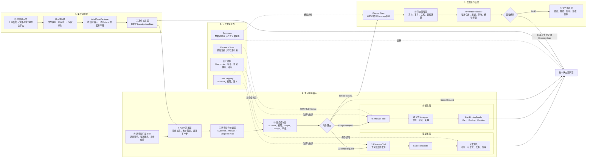
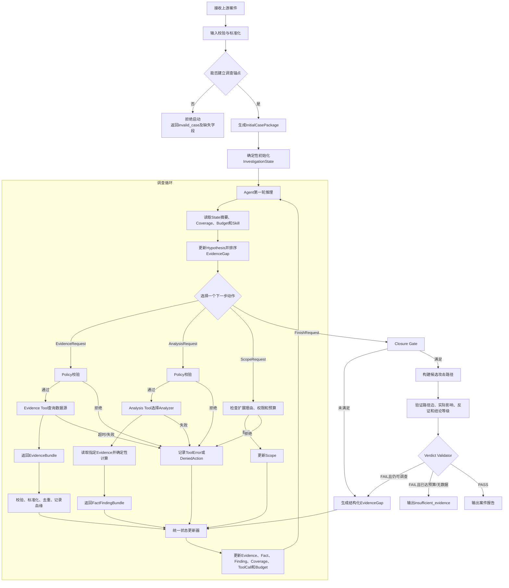
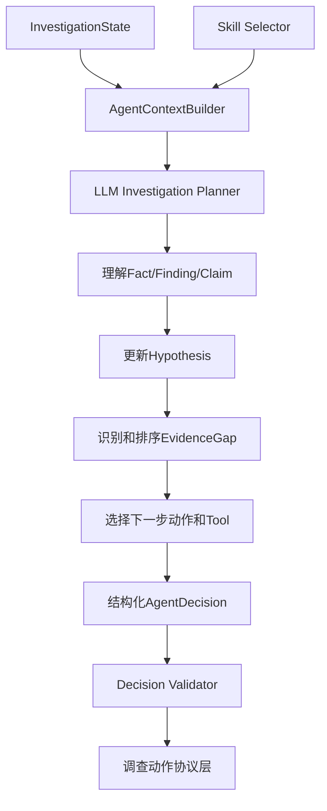

# Linux 未知文件威胁研判 Agent：第一版完整方案

> 文档状态：当前方案定版草案  
> 目标阶段：使用具体 Case 尽快跑通主动调查闭环  
> Agent Runtime：第一版优先使用 LangChain Deep Agents，业务内核保持框架无关  
> 适用范围：Linux 未知文件威胁研判、攻击路径还原与案件级结论输出

---

## 1. 项目目标

本项目接收检测系统发现的 Linux 未知文件，以该文件为案件调查锚点，分析：

1. 文件是什么、位于哪里、由谁持有；
2. 文件通过什么方式落地；
3. 文件是否真实执行；
4. 执行后产生了哪些进程、文件、网络、持久化和系统行为；
5. 是否造成真实影响；
6. 是否参与后门控制、数据窃取、勒索破坏或其他真实攻击；
7. 如何用可追溯证据还原攻击路径；
8. 当证据不足时，明确输出缺失证据和结论限制，而不是补全或编造攻击链。

系统的核心能力不是一次性总结输入，而是：

```text
理解案件
→ 建立候选假设
→ 识别证据缺口
→ 主动获取新证据
→ 对已有证据执行确定性分析
→ 更新案件状态和攻击假设
→ 继续调查或申请结案
→ 验证攻击路径和Verdict
```

---

## 2. 第一版验证目标

第一版不建设完整生产平台，重点验证以下能力：

1. Agent 只从初始案件材料启动，而不是一次性读取所有证据；
2. Agent 能区分 Evidence、Claim、Fact、Finding、Hypothesis 和未知事项；
3. Agent 能识别当前最重要的 EvidenceGap；
4. Agent 能主动选择 Evidence Tool 获取新证据；
5. Agent 能主动选择 Analysis Tool 分析已有证据；
6. Analysis Tool 使用确定性 Analyzer，而不是由 LLM 自行计算；
7. 新证据和分析结果能够更新 InvestigationState；
8. Agent 能根据新 Fact/Finding 加强、削弱或推翻 Hypothesis；
9. Agent 能构建带 Evidence 引用的攻击路径；
10. Verdict Validator 能阻止无证据结论；
11. 数据不足时能够输出 `insufficient_evidence`；
12. 合法反例中不会因为“持久化 + 周期性外连”直接误报后门。

---

## 3. 当前已确定的关键设计决策

### 3.1 Agent 与确定性程序的边界

LLM 负责：

```text
案件语义理解
Hypothesis创建和更新
EvidenceGap识别和排序
下一步动作选择
Evidence Tool或Analysis Tool选择
参数建议
CandidateVerdict组织
报告文字表达
```

确定性程序负责：

```text
输入校验和字段标准化
日志解析
Evidence生成、去重和存储
文件与进程实体解析
网络周期等统计计算
持久化、敏感访问和破坏行为识别
Scope与Budget控制
Fact与Finding构建
攻击路径边验证
Verdict证据门
```

### 3.2 Evidence Tool 与 Analysis Tool

两类 Tool 统一注册到 Tool Registry，但职责不同：

```text
Evidence Tool
→ 访问数据源，获取新Evidence
→ 返回EvidenceBundle

Analysis Tool
→ 读取State中已有Evidence
→ 调用确定性Analyzer
→ 返回FactFindingBundle
```

### 3.3 调查动作协议

Agent 只能产生四类结构化动作：

```text
EvidenceRequest
AnalysisRequest
ScopeRequest
FinishRequest
```

### 3.4 Analyzer 的定位

Analyzer 是可复用的确定性程序。需要由 Agent 主动选择时，通过 Analysis Tool 暴露：

```text
Analysis Tool = 调用接口
Analyzer = 核心算法实现
Fact/Finding = 分析输出
```

### 3.5 Hypothesis 的产生者

证据和 Analyzer 不直接产生 Hypothesis。

```text
Evidence Tool产生Evidence
Analysis Tool产生Fact/Finding
Agent根据Fact/Finding更新Hypothesis
```

### 3.6 结案控制

Agent 只能提交 FinishRequest，不能直接结束案件。结案必须经过：

```text
Closure Gate
→ 攻击路径构建
→ Verdict Validator
→ PASS或FAIL
```

---

## 4. 总体架构



十一层分别为：

1. 案件输入层；
2. 案件状态层；
3. Agent 决策层；
4. 调查知识层 Skill；
5. 调查动作协议层；
6. 安全控制层；
7. 证据调查层；
8. 证据分析层；
9. 攻击路径层；
10. 结论验证层；
11. 报告输出层。

图中的输入适配器、Tool Registry、Evidence Store、Coverage、统一状态更新器和运行控制不是新增的业务层，而是十一层落地时必须具备的公共组件。这样既保留概念分层，也能在代码中明确模块归属。

### 4.1 新版总体图补充了什么

| 补充项 | 解决的问题 | 第一版要求 |
| --- | --- | --- |
| 输入适配器 | 上游类型、枚举、时间单位不统一 | 必须实现 |
| InitialCasePackage | 区分原始材料、上游Claim和系统确认事实 | 必须实现 |
| Tool Registry | Evidence Tool和Analysis Tool缺少统一发现、Schema和权限管理 | 必须实现 |
| 证据接入组件 | Tool结果直接写State会造成脏数据、重复数据和血缘丢失 | 必须实现 |
| 统一状态更新器 | 多条回流路径各自修改State，容易产生不一致 | 必须实现 |
| Evidence Store | 原始Evidence与Agent上下文混在一起，无法追溯 | 第一版可用本地实现 |
| 双Coverage | “没有查到”与“没有数据可查”容易混淆 | 必须实现基础版 |
| 运行控制 | 无限循环、重复调用、超时后状态不明 | 必须实现Budget和审计；Checkpoint可后置 |
| 定向补证 | Verdict失败只返回“证据不足”，Agent不知道下一步查什么 | 必须返回结构化EvidenceGap |
| 替代路径与反证 | 只拼一条攻击路径容易确认偏误 | 第一版支持至少一个良性反解释 |

---

## 5. 完整运行流程



### 5.1 一轮 Agent 到底由 LLM 做什么

LLM 每轮只完成以下决策任务，不直接读数据库、不直接把日志解释为确定事实：

1. 阅读经过裁剪的 `InvestigationStateView`；
2. 判断现有 Hypothesis 哪些被支持、削弱或需要新增；
3. 从未满足的 `EvidenceGap` 中选择优先级最高的一项；
4. 决定获取新Evidence、分析已有Evidence、申请扩展Scope，还是申请结案；
5. 从允许的 Tool 清单中选择一个 Tool，并生成符合Schema的Request；
6. 用新的 Fact/Finding 更新Hypothesis的状态和理由；
7. 组织 CandidateVerdict，但无权绕过 Closure Gate。

### 5.2 一轮程序执行什么

框架和确定性组件负责：

1. 构建只包含必要内容的 `InvestigationStateView`；
2. 校验Request Schema、Tool白名单、Scope、权限和Budget；
3. 执行Tool并捕获超时、空结果、部分结果和错误；
4. 对Evidence执行标准化、去重、血缘记录和持久化；
5. 运行Analyzer并生成可复现的Fact/Finding/Relation；
6. 原子更新State并记录ToolCall；
7. 计算Coverage和停止条件；
8. 对FinishRequest执行结案验证。

### 5.3 必须区分的四种“没有结果”

| 状态 | 含义 | State处理 |
| --- | --- | --- |
| `empty` | 查询成功，在已覆盖范围内没有命中 | 保存负证据和查询范围 |
| `unavailable` | 数据源不存在、未接入或保留期外 | 降低DataSourceCoverage |
| `partial` | 只返回部分时间、主机或字段 | 记录覆盖边界并保留EvidenceGap |
| `error` | Tool超时、参数错误或系统异常 | 记录ToolError，可按策略重试 |

`empty` 不能自动证明行为没有发生；只有查询范围、数据完整性和时效性满足要求时，才可以作为有限的反证使用。

---

## 6. 第一层：案件输入层

### 6.1 输入字段

第一版接收上游未知文件记录，主要字段如下：

| 字段 | 含义 |
| --- | --- |
| `fileHash` | SHA256，未知文件主标识 |
| `md5` | 辅助文件标识 |
| `filePath` | 文件完整路径 |
| `fileType` | ELF、脚本、压缩包等 |
| `fileSize` | 文件大小 |
| `fileMode` | Linux 文件权限 |
| `Source` | 一级资产/网元 ID |
| `Sub_Asset` | 二级资产/节点 ID |
| `Status` | 上游文件分类状态 |
| `Sync_status` | 上游处理和同步状态 |
| `Discovery_Time` | 首次发现时间 |
| `Recent_Time` | 最近发现时间 |
| `File_modify_time` | 文件修改时间 |
| `File_create_time` | 文件创建时间 |
| `File_access_time` | 文件访问时间 |
| `File_user/File_UID` | 文件所有者和 UID |
| `File_Group/File_GID` | 文件所属组和 GID |
| `Process_NAME` | 上游报告的触发进程名 |
| `PID/PPID` | 上游报告的进程 ID |
| `UID/GID/EUID/EGID` | 进程身份 |
| `PROCESS_CREATE_TIME` | 进程创建时间 |
| `HOFS_PATH` | 样本存储引用 |
| `TASK_ID/SCAN_TYPE` | 扫描任务和扫描来源 |
| `DETAIL` | 上游进程链 JSON |
| `USER_NAME/VISITOR_IP/LOGIN_ACCOUNT` | 用户上下文 |
| `POD_ID/CONTAINER_ID/CONTAINER_NAME` | 容器上下文 |
| `EXTEND_FILED` | 扩展字段 |
| `REALTIME_TYPE` | 文件落盘或进程启动 |
| `SPECIAL_STATUS` | 特征状态 |
| `hashlist` | 相关进程链文件 Hash |

### 6.2 输入层职责

```text
完整保存原始输入
校验Schema、类型和枚举
标准化时间、Hash、路径和身份字段
构建FileSubject
提取Host、Container和User上下文
将DETAIL转换为ProcessClaim和ProcessChainClaim
生成InitialEvidence
生成安全确定的InitialFact
生成初始EvidenceGap
生成初始Scope
输出InitialCasePackage
```

### 6.3 InitialCasePackage

`InitialCasePackage` 是项目自定义的只读案件启动结构体，不是框架内置类型。

```text
InitialCasePackage
├── case
├── subject_file
├── environment
├── detection_context
├── initial_evidence
├── initial_claims
├── initial_facts
├── initial_evidence_gaps
├── investigation_scope
├── data_quality
└── raw_reference
```

### 6.4 Claim 与 Fact

上游 DETAIL 进程链、`REALTIME_TYPE=1`、`Sync_status=5` 等信息先作为 Claim：

```text
上游报告文件与PID 1234的进程启动有关
上游报告sshd→bash→kinsing进程链
```

只有通过独立 Evidence 验证后，才能升级为 Fact。

### 6.5 输入层输出

```text
InitialCasePackage
→ 由确定性初始化程序转换为InvestigationState
```

---

## 7. 第二层：案件状态层

`InvestigationState` 是案件调查过程的唯一结构化状态来源。

### 7.1 核心结构

```text
InvestigationState
├── task
├── entities
├── relations
├── evidence
├── claims
├── facts
├── findings
├── hypotheses
├── evidence_gaps
├── evidence_coverage
├── scope
├── budget
├── actions
├── tool_calls
├── attack_path
├── candidate_verdict
├── validation_result
└── status
```

### 7.2 核心对象

#### Evidence

从输入或 Tool 获得的原始/标准化证据，必须包含来源和原始记录引用。

#### Claim

上游系统或 Agent 提出的待验证声明。

状态：

```text
unverified
supported
confirmed
contradicted
unverifiable
```

#### Fact

经过 Evidence 和确定性验证确认的原子事实。

#### Finding

Analysis Tool 通过 Analyzer 识别出的行为模式。

#### Hypothesis

Agent 对案件的候选解释，必须同时保存支持证据、反证和缺失证据。

#### EvidenceGap

仍需回答的调查问题，是 Agent 主动调查的驱动力。

#### EvidenceCoverage

需要拆成两类：

```text
DataSourceCoverage
→ 数据源实际覆盖哪些主机、容器和时间

RequiredEvidenceCoverage
→ 当前假设所需证据类型是否齐全
```

#### Scope

允许 Agent 调查的主机、容器、时间、实体和数据域。

#### Budget

最大循环、Tool 调用、时间范围、结果数量和范围扩展次数。

### 7.3 状态阶段

```text
initialized
ready
investigating
waiting_approval
building_path
validating
completed
insufficient_evidence
failed
```

---

## 8. 第三层：Agent 决策层

### 8.1 Agent 内部结构



### 8.2 LLM 负责的任务

```text
理解当前案件状态
区分已知、声明、程序发现和未知
维护恶意、正常和证据不足等候选假设
识别EvidenceGap
对EvidenceGap排序
选择动作类型
选择候选Tool
给出参数建议
提交CandidateVerdict
生成基于已验证事实的报告文字
```

### 8.3 LLM 禁止承担的任务

```text
创建Evidence
把Claim直接改成Fact
直接创建Finding
自行解析日志
自行统计连接周期
自行扩大Scope
自行批准Tool调用
自行通过Verdict
引用State中不存在的ID
```

### 8.4 AgentContext

每轮只提供：

```text
案件目标
目标文件和环境摘要
高价值Fact和Finding
待验证Claim
开放Hypothesis
高优先级EvidenceGap
Coverage摘要
最近Tool结果
Scope和Budget
候选Tool
相关Skill章节
```

不向 LLM 每轮发送全部原始日志。

### 8.5 AgentDecision

```text
AgentDecision
├── assessment
├── hypothesis_updates
├── evidence_gap_updates
├── selected_gap_id
├── candidate_action
└── reasoning_summary
```

只保存简短、可审计的决策理由，不依赖或保存完整隐藏推理。

---

## 9. 第四层：调查知识层 Skill

第一版使用一个主 Skill：

```text
investigate-linux-unknown-file
```

内部章节：

```text
通用文件身份和来源调查
实际执行验证
后门/C2调查
数据窃取调查
勒索破坏调查
反证调查
证据要求
停止条件
```

Skill 的作用：

```text
告诉Agent应当怎样调查
定义不同现象对应的候选假设
定义假设需要哪些Evidence
推荐Evidence Tool和Analysis Tool
说明哪些弱信号不能直接下结论
要求检查正常解释和反证
定义场景级停止条件
```

Skill 不包含大规模数据计算，也不直接访问数据源。

---

## 10. 第五层：调查动作协议层

该层不做推理，只把 AgentDecision 中的候选动作转换成固定 Schema。

### 10.1 EvidenceRequest

目的：获取新 Evidence。

```text
question
reason
related_hypothesis_ids
related_gap_ids
tool_name
arguments
expected_evidence_types
priority
```

### 10.2 AnalysisRequest

目的：分析已有 Evidence。

```text
question
reason
related_hypothesis_ids
related_gap_ids
tool_name
evidence_ids
analysis_parameters
expected_input_types
expected_output_types
```

### 10.3 ScopeRequest

目的：请求扩大主机、容器、时间或数据域范围。

### 10.4 FinishRequest

目的：提交 CandidateVerdict 并申请结案。

### 10.5 动作生命周期

```text
proposed
validating
approved
approved_with_limits
needs_approval
denied
executing
completed
failed
```

---

## 11. 第六层：安全控制层

Policy Engine 对所有请求进行确定性检查。

### 11.1 通用检查

```text
动作Schema
Tool是否注册
Tool类别是否与Request匹配
输入参数
只读属性
Scope
Budget
重复调用
审批要求
```

### 11.2 AnalysisRequest 专属检查

```text
Evidence ID是否存在
Evidence是否属于当前案件
Evidence类型是否符合Analyzer要求
Evidence是否在当前Scope内
是否对同一Evidence和参数重复分析
```

### 11.3 PolicyDecision

```text
approved
approved_with_limits
denied
needs_repair
needs_approval
needs_scope_expansion
```

### 11.4 第一版禁止项

```text
通用Shell
执行未知文件
修改目标主机
删除或隔离文件
停止服务
修改防火墙
主动连接可疑地址
无依据扩大主机范围
```

---

## 12. 统一 Tool Registry

Tool Registry 同时管理 Evidence Tool 和 Analysis Tool。

```text
ToolDefinition
├── name
├── category
├── description
├── input_schema
├── output_schema
├── input_evidence_types
├── output_evidence_types
├── output_fact_types
├── output_finding_types
├── read_only
├── permissions
├── timeout
├── result_limit
└── implementation
```

类别：

```text
category=evidence
category=analysis
```

参考 EFF-Monitoring，查询 Tool 和 `analysis.*` Tool 统一注册和执行；本项目进一步将 Analysis Tool 输出升级为明确的 Fact/Finding。

---

## 13. 第七层：证据调查层

### 13.1 作用

```text
EvidenceRequest
→ Evidence Tool
→ 数据源查询/日志解析
→ EvidenceBundle
```

### 13.2 Agent 可见 Evidence Tool

```text
collect_file_identity_evidence
collect_file_origin_evidence
collect_execution_evidence
collect_process_evidence
collect_network_evidence
collect_persistence_evidence
collect_sensitive_data_evidence
collect_destructive_activity_evidence
get_evidence_coverage
```

### 13.3 内部原子查询 Tool

```text
query_file_events
query_process_events
query_network_events
query_dns_events
query_auth_events
query_persistence_events
query_system_events
```

### 13.4 日志解析 Tool

```text
parse_auditd_records
parse_journald_records
parse_auth_log_records
parse_systemd_records
parse_cron_records
```

### 13.5 静态信息 Tool

```text
get_file_metadata
get_package_ownership
get_elf_static_report
get_script_static_report
```

HOFS 仅作为样本引用。第一版不在普通主机上执行未知样本。

### 13.6 EvidenceBundle

```text
EvidenceBundle
├── bundle_id
├── request_id
├── tool_name
├── evidence
├── coverage
├── limitations
├── errors
└── lineage
```

Evidence Tool 不输出 Finding、Hypothesis 或 Verdict。

### 13.7 空结果语义

必须区分：

```text
查询成功但无匹配
数据源不可用
时间覆盖不完整
结果被截断
查询失败
```

不得简单返回 `None`。

---

## 14. Evidence 接收与存储

该部分位于证据调查层和 State 之间，不单独编号。

职责：

```text
Evidence Schema校验
时间和字段基础标准化
Evidence ID生成
Evidence去重
原始来源和lineage保留
Coverage合并
写入State.evidence
```

该部分不运行攻击行为 Analyzer。

---

## 15. 第八层：证据分析层

### 15.1 作用

```text
AnalysisRequest
→ Analysis Tool
→ 读取指定Evidence
→ Analyzer
→ FactFindingBundle
```

### 15.2 第一版 Analysis Tool

```text
analysis.verify_file_execution
analysis.reconstruct_process_tree
analysis.detect_periodic_connections
analysis.detect_persistence
```

后续扩展：

```text
analysis.detect_remote_command_execution
analysis.detect_reverse_connection
analysis.detect_sensitive_access
analysis.detect_data_staging
analysis.detect_outbound_transfer
analysis.detect_exfiltration_chain
analysis.detect_mass_file_changes
analysis.detect_file_encryption
analysis.detect_service_disruption
analysis.detect_backup_destruction
analysis.detect_ransom_note
```

### 15.3 Analyzer

Analyzer 使用：

```text
规则
正则
路径匹配
数量统计
时间窗口
时间间隔
进程树
实体关系
行为序列
状态机
```

同样输入和规则应产生同样输出。

### 15.4 Analysis Tool 输入不足

如果 Evidence 不足，返回：

```text
status=insufficient_input
missing_evidence_types
limitations
```

Agent 据此生成新的 EvidenceRequest。

### 15.5 FactFindingBundle

```text
FactFindingBundle
├── input_evidence_refs
├── facts
├── findings
├── relations
├── limitations
└── lineage
```

Analysis Tool 不输出 Hypothesis 和最终 Verdict。

---

## 16. 文件与进程实体解析

### 16.1 FileEntity

不能只使用路径识别文件。

```text
host_id
container_id
path
sha256
device
inode
size
first_seen
last_seen
```

### 16.2 ProcessEntity

不能只使用 PID。

```text
host_id
boot_id
pid
start_time
container_id
pid_namespace
executable_file_entity_id
```

推荐进程身份：

```text
host_id + boot_id + pid + start_time
```

### 16.3 Relation 状态

```text
observed
correlated
inferred
unknown
```

时间接近不能自动视为因果。

---

## 17. 三类攻击的专用能力

### 17.1 后门/C2

Evidence Tool：

```text
collect_execution_evidence
collect_process_evidence
collect_network_evidence
collect_persistence_evidence
collect_system_evidence
```

Analysis Tool：

```text
analysis.verify_file_execution
analysis.reconstruct_process_tree
analysis.detect_periodic_connections
analysis.detect_reverse_connection
analysis.detect_remote_command_execution
analysis.detect_persistence
analysis.detect_deleted_running_file
```

结论门：

```text
实际执行
+ 控制或异常通信行为
+ 命令执行、持久化或隐蔽控制之一
+ 排除明显合法解释
```

### 17.2 数据窃取

Evidence Tool：

```text
collect_sensitive_data_evidence
collect_file_activity_evidence
collect_process_evidence
collect_network_evidence
```

Analysis Tool：

```text
analysis.detect_sensitive_access
analysis.detect_data_staging
analysis.detect_archive_encryption
analysis.detect_outbound_transfer
analysis.detect_exfiltration_chain
```

结论门：

```text
敏感数据访问
+ 数据暂存或处理
+ 对外传输
+ 进程和时间关系能够关联
```

### 17.3 勒索破坏

Evidence Tool：

```text
collect_file_activity_evidence
collect_process_evidence
collect_service_evidence
collect_backup_snapshot_evidence
```

Analysis Tool：

```text
analysis.detect_mass_file_changes
analysis.detect_file_encryption
analysis.detect_service_disruption
analysis.detect_backup_destruction
analysis.detect_ransom_note
```

结论门：

```text
目标文件实际执行
+ 批量修改或加密业务文件
+ 造成实际不可用影响
```

---

## 18. 第九层：攻击路径层

### 18.1 节点

```text
Host
Container
File
Process
User
Service
NetworkEndpoint
Command
SensitiveData
```

### 18.2 边

```text
created
downloaded
executed
spawned
connected_to
created_persistence
read
archived
transferred
modified
destroyed
```

### 18.3 路径要求

每条边必须包含：

```text
source_entity
target_entity
relation_type
timestamp
relation_state
evidence_refs
confidence
```

输出：

```text
主攻击路径
备选解释
孤立证据
冲突关系
推断边
无法确认的路径缺口
```

---

## 19. 第十层：结论验证层

### 19.1 Closure Gate

进入攻击路径和 Verdict 前检查：

```text
文件身份是否明确
执行状态是否明确或已确认无法获得
关键攻击假设是否完成证据检查
是否调查合理反证
实际影响是否调查
关键Coverage是否已知
是否仍有可合理解决的高优先级Gap
```

### 19.2 Verdict Validator

检查：

```text
Groundedness：结论是否引用Evidence
Execution：是否确认实际执行
Attribution：行为是否属于目标文件
Impact：是否确认实际影响
Path：路径边是否有证据
Counterevidence：是否考虑反证
Coverage：数据是否支持结论
Consistency：证据之间是否冲突
```

### 19.3 输出

```text
PASS
FAIL
accepted_claims
rejected_claims
unsupported_claims
missing_evidence_gaps
repair_actions
maximum_allowed_verdict
```

### 19.4 结论等级

```text
confirmed
highly_likely
suspicious
insufficient_evidence
likely_benign
```

---

## 20. 第十一层：报告输出层

报告至少包含：

```text
案件摘要
案件结论和结论等级
威胁类型
文件身份和来源
实际执行情况
进程和运行行为
网络行为
持久化行为
敏感数据和破坏行为
实际影响
攻击路径
关键Evidence/Fact/Finding
反证
未解决问题
EvidenceCoverage和数据限制
Agent调查轨迹
```

追溯关系：

```text
Verdict
→ Fact/Finding
→ Evidence
→ 原始记录
```

---

## 21. Deep Agents 实现框架

第一版可以使用 LangChain Deep Agents 加速运行时建设。

### 21.1 Deep Agents 负责

```text
LLM调用
Tool暴露与调用
Agent循环基础能力
上下文和checkpoint基础能力
middleware接入
```

### 21.2 项目自己负责

```text
InitialCasePackage
InvestigationState
AgentContext
AgentDecision
四类Request
Tool Registry业务元数据
Policy Engine
Evidence/Fact/Finding Schema
Entity Resolver
Analyzer
Attack Path
Closure Gate
Verdict Validator
Case评测
```

### 21.3 Runtime 适配接口

```python
class AgentRuntime(Protocol):
    async def decide(
        self,
        context: AgentContext,
    ) -> AgentDecision:
        ...
```

第一版：

```text
DeepAgentsRuntime
```

未来可替换为自研 Runtime，而不重写业务内核。

### 21.4 第一版不使用多 Agent

第一版采用：

```text
一个主调查Agent
+ 一个主调查Skill
+ Evidence Tools
+ Analysis Tools
+ 统一InvestigationState
```

后门、窃取和勒索先作为 Skill 章节及 Analyzer 集合，不拆成三个子 Agent。

---

## 22. 推荐代码结构

```text
unknown-file-threat-agent/
├── cases/
│   ├── c2_malicious/
│   ├── c2_missing_evidence/
│   └── legitimate_agent/
│
├── case_input/
│   ├── schemas/
│   ├── validators/
│   ├── normalizers/
│   └── service.py
│
├── domain/
│   ├── initial_case.py
│   ├── investigation_state.py
│   ├── evidence.py
│   ├── claim.py
│   ├── entity.py
│   ├── relation.py
│   ├── fact.py
│   ├── finding.py
│   ├── hypothesis.py
│   ├── evidence_gap.py
│   ├── coverage.py
│   ├── scope.py
│   └── verdict.py
│
├── agent/
│   ├── runtime.py
│   ├── deepagents_runtime.py
│   ├── context_builder.py
│   ├── decision.py
│   ├── decision_validator.py
│   └── prompts/
│
├── actions/
│   ├── evidence_request.py
│   ├── analysis_request.py
│   ├── scope_request.py
│   ├── finish_request.py
│   └── action_parser.py
│
├── policy/
│   ├── engine.py
│   ├── schema_policy.py
│   ├── tool_policy.py
│   ├── evidence_reference_policy.py
│   ├── scope_policy.py
│   ├── budget_policy.py
│   └── approval_policy.py
│
├── tools/
│   ├── registry.py
│   ├── executor.py
│   ├── evidence/
│   ├── analysis/
│   ├── queries/
│   ├── parsers/
│   ├── static/
│   └── adapters/
│
├── analyzers/
│   ├── execution.py
│   ├── process_tree.py
│   ├── network.py
│   ├── persistence.py
│   ├── sensitive_access.py
│   ├── data_staging.py
│   ├── outbound_transfer.py
│   └── ransomware.py
│
├── evidence_store/
│   ├── intake.py
│   ├── normalizer.py
│   ├── deduplicator.py
│   └── repository.py
│
├── correlation/
│   ├── file_resolver.py
│   ├── process_resolver.py
│   ├── relation_builder.py
│   └── attack_path.py
│
├── verdict/
│   ├── closure_gate.py
│   ├── validator.py
│   └── policies/
│
├── reporting/
│   ├── markdown_report.py
│   └── json_report.py
│
├── skills/
│   └── investigate_linux_unknown_file/
│       └── SKILL.md
│
├── evaluations/
│   ├── trajectory_evaluator.py
│   ├── evidence_evaluator.py
│   ├── verdict_evaluator.py
│   └── expected_results/
│
└── run_case.py
```

---

## 23. 第一版最小实现范围

### 23.1 数据对象

```text
InitialCasePackage
InvestigationState
Evidence
Claim
Entity
Relation
Fact
Finding
Hypothesis
EvidenceGap
EvidenceCoverage
Scope
Budget
AgentDecision
四类Request
CandidateVerdict
```

### 23.2 Evidence Tool

```text
collect_file_identity_evidence
collect_execution_evidence
collect_process_evidence
collect_network_evidence
collect_persistence_evidence
get_evidence_coverage
```

### 23.3 Analysis Tool

```text
analysis.verify_file_execution
analysis.reconstruct_process_tree
analysis.detect_periodic_connections
analysis.detect_persistence
```

### 23.4 数据源

第一版只实现：

```text
CaseJsonAdapter
```

Agent 只能读取 `initial_case.json`，其他证据必须通过 Tool 查询。

### 23.5 报告

```text
report.json
report.md
```

---

## 24. 第一版 Case 设计

### 24.1 恶意后门/C2 Case

```text
Web或SSH来源
→ 未知ELF落地
→ 实际执行
→ systemd或cron持久化
→ 周期性外连
→ 执行系统探测或控制命令
```

预期：

```text
malicious
backdoor_c2
high confidence
```

### 24.2 合法程序反例

```text
合法软件包安装
→ systemd服务
→ 周期性连接企业管理平台
→ 包归属、部署任务和目的地址上下文完整
```

预期：

```text
likely_benign
```

### 24.3 证据不足 Case

```text
文件存在
→ 上游报告进程链
→ auditd和网络日志缺失
```

预期：

```text
insufficient_evidence
```

### 24.4 不可归因 Case

```text
未知文件执行时间附近存在外连
→ 网络事件没有进程归属
```

预期：

```text
不得强行构造文件→进程→外连路径
```

---

## 25. 第一版验收标准

1. Agent 只从初始案件包启动；
2. 上游进程链作为 Claim，而非自动 Fact；
3. Agent 能提出至少一个攻击解释和一个正常/证据不足解释；
4. Agent 能识别并排序 EvidenceGap；
5. Agent 能正确选择 EvidenceRequest 或 AnalysisRequest；
6. Tool 调用经过 Policy Engine；
7. Evidence Tool 不直接输出攻击结论；
8. Analysis Tool 的 Finding 引用真实 Evidence ID；
9. PID复用和路径替换不会造成错误关联；
10. 空查询能够区分无匹配、无数据、部分覆盖和查询失败；
11. 攻击路径每条边都有 Evidence 引用或明确标记为推断；
12. Verdict Validator 能拒绝无执行证据的“确认攻击”；
13. 合法反例输出 `likely_benign`；
14. 证据缺失反例输出 `insufficient_evidence`；
15. 保存 AgentDecision、Request、PolicyDecision 和 ToolCall 轨迹；
16. 未知样本不在普通主机上执行。

---

## 26. 借鉴 EFF-Monitoring 的部分

借鉴：

```text
结构化AgentState
任务类型和Evidence Role思想
Required Evidence Type到Tool的映射
Tool Registry
Tool Schema
Evidence Pack
数据血缘lineage
查询Tool与analysis.* Tool统一注册
Agent生成Tool Plan
Evidence Coverage检查
Reflector和Repair Actions
Tool调用审计
确定性统计拒绝LLM心算
```

未直接照搬：

```text
IP和通用告警中心化模型
告警认领和运营流转
通用aggregate/groupby作为主要业务分析
资产和威胁情报驱动的最终判断
统一Evidence Pack代替Fact/Finding分层
```

本项目新增：

```text
FileSubject和文件实体身份
ProcessClaim与ProcessEntity分离
实际执行验证
EvidenceRequest与AnalysisRequest显式区分
Linux专用Evidence Tool
Linux专用攻击Analyzer
Fact/Finding/Hypothesis分层
ScopeRequest
攻击路径图
场景化Verdict证据门
实际影响证明
DataSourceCoverage
反证和备选解释
```

---

## 27. 当前遗留问题

### 27.1 P0：第一版实现前必须确认

1. 上游字段的真实类型、单位和枚举；
2. `DETAIL.tree[]` 的真实顺序；
3. `Sync_status=5` 的精确业务含义；
4. `REALTIME_TYPE=1` 是否包含可靠 exec 语义；
5. Hash、路径、inode 和样本引用的可用性；
6. PID是否有boot ID和start time；
7. 容器PID与宿主机PID如何映射；
8. 各日志源的时间单位、时区和保留范围；
9. 网络事件是否具备进程归属；
10. Tool输入输出Schema；
11. Evidence→Fact升级规则；
12. Finding类型和Analyzer规则；
13. 第一版后门/C2 Verdict门；
14. Closure Gate规则；
15. 三个基础Case的数据与期望答案。

### 27.2 P1：三类攻击覆盖前需解决

1. 敏感文件目录和凭据路径基线；
2. 数据暂存、归档、加密和外发的行为链；
3. 批量文件修改和加密阈值；
4. LVM/Btrfs/ZFS及备份破坏证据；
5. 服务停止与实际业务影响；
6. 合法软件包、部署任务和运维活动反证；
7. 多候选攻击路径；
8. 冲突证据处理；
9. 数据源Coverage与RequiredEvidenceCoverage；
10. Agent上下文裁剪；
11. Scope扩展审批；
12. Prompt Injection隔离。

### 27.3 P2：生产化问题

1. 真实EDR、日志平台和数据库Adapter；
2. Checkpoint和中断恢复；
3. Tool重试、超时和幂等性；
4. 多租户权限；
5. Evidence不可篡改存储；
6. Tool、Analyzer、Skill、Prompt和模型版本；
7. 人工审核界面；
8. 性能、Token和查询成本监控；
9. 大规模Evidence索引；
10. 多Agent或并行调查的必要性评估。

---

## 28. 安全与可靠性风险

| 风险 | 后果 | 应对 |
| --- | --- | --- |
| 把Claim当Fact | 错误攻击路径 | Claim独立建模，必须验证升级 |
| PID复用 | 错误关联进程和网络 | host+boot+pid+start_time |
| 文件路径被替换 | 错误识别目标文件 | Hash、inode、时间联合识别 |
| 时间漂移 | 错误拼接事件 | 保留时区、boot ID、误差和时间质量 |
| 数据源缺失 | 错误判断未发生 | EvidenceCoverage |
| 重复日志 | 重复计数和升高置信度 | Evidence去重和多源血缘 |
| 时间接近被当作因果 | 编造攻击链 | Relation状态和证据引用 |
| Agent任意查询 | 成本和权限风险 | Policy、Scope、Budget |
| Agent自行计算 | 数字和模式错误 | Analysis Tool |
| Prompt Injection | 调查规则被恶意文本影响 | 不可信数据隔离 |
| 无限循环 | 调查失控 | 最大迭代、Tool预算和停止条件 |
| 结论过度 | 无证据确认攻击 | Closure Gate和Verdict Validator |

---

## 29. 推荐实施顺序

### 阶段 0：冻结术语和Schema

```text
InitialCasePackage
InvestigationState
Evidence
Claim
Fact
Finding
Hypothesis
EvidenceGap
Coverage
四类Request
```

### 阶段 1：制作三个基础Case

```text
恶意后门
合法程序
证据不足
```

### 阶段 2：实现CaseJsonAdapter和Evidence Tool

Agent必须通过 Tool 才能发现完整案件证据。

### 阶段 3：实现实体解析和Evidence Store

重点解决文件身份、进程身份、去重和Coverage。

### 阶段 4：实现第一批Analysis Tool

```text
verify_file_execution
reconstruct_process_tree
detect_periodic_connections
detect_persistence
```

### 阶段 5：实现AgentContext、AgentDecision和DeepAgentsRuntime

跑通：

```text
EvidenceGap
→ EvidenceRequest
→ Evidence
→ AnalysisRequest
→ Finding
→ Hypothesis更新
```

### 阶段 6：攻击路径与Verdict

实现主路径、证据引用、Closure Gate和最小结论门。

### 阶段 7：评测

同时评测：

```text
最终Verdict
Tool选择
证据覆盖
调查轨迹
攻击路径
误报和证据不足处理
```

---

## 30. 第一版最终交付物

```text
1个Deep Agent主调查员
1个Linux未知文件调查Skill
3至4个固定Case
6个Evidence Tool
4个Analysis Tool
1套InvestigationState
1个Policy Engine
1个Evidence Store
1套Entity Resolver
1个Attack Path Builder
1个Closure Gate
1个Verdict Validator
Markdown和JSON报告
Agent调查轨迹和评测结果
```

---

## 31. 最终统一表述

本项目第一版采用 LangChain Deep Agents 作为可替换的 Agent Runtime，以自定义 InvestigationState 为案件状态中心，以 Linux 未知文件调查 Skill 提供调查方法，由 LLM 负责案件理解、Hypothesis 更新、EvidenceGap 识别和下一步动作选择。Agent 通过 EvidenceRequest 调用 Evidence Tool 获取新 Evidence，通过 AnalysisRequest 调用 Analysis Tool 和确定性 Analyzer 生成 Fact/Finding，通过 ScopeRequest 申请扩大调查范围，通过 FinishRequest 申请结案。所有动作经过 Policy Engine 控制，所有证据、分析结果和血缘写入案件状态。系统在证据充分后构建带 Evidence 引用的攻击路径，并通过 Closure Gate 和 Verdict Validator 检查执行、行为、归因、实际影响、反证和数据覆盖，最终输出可审计的案件结论；证据不足时继续补证或明确输出 `insufficient_evidence`。
