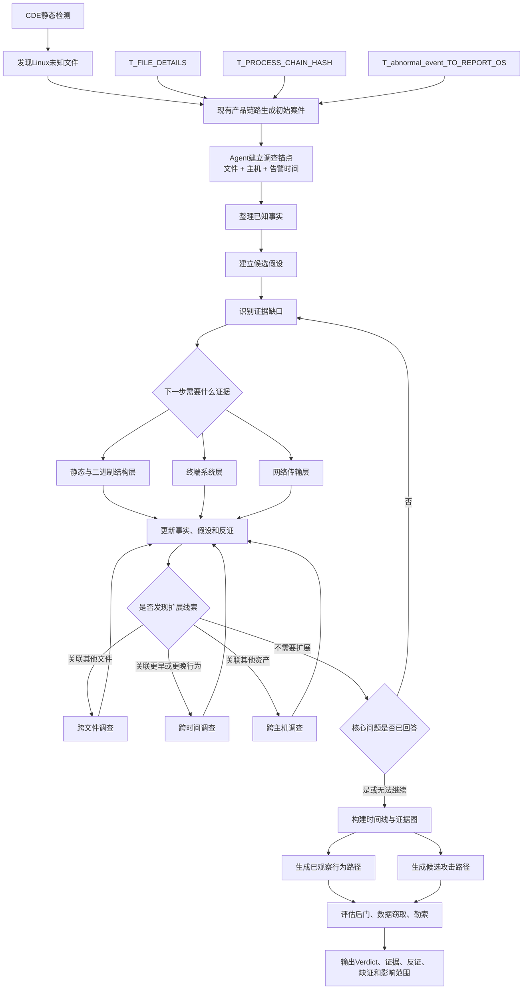
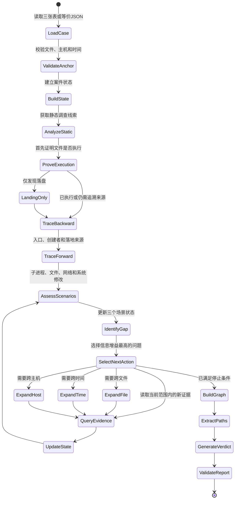
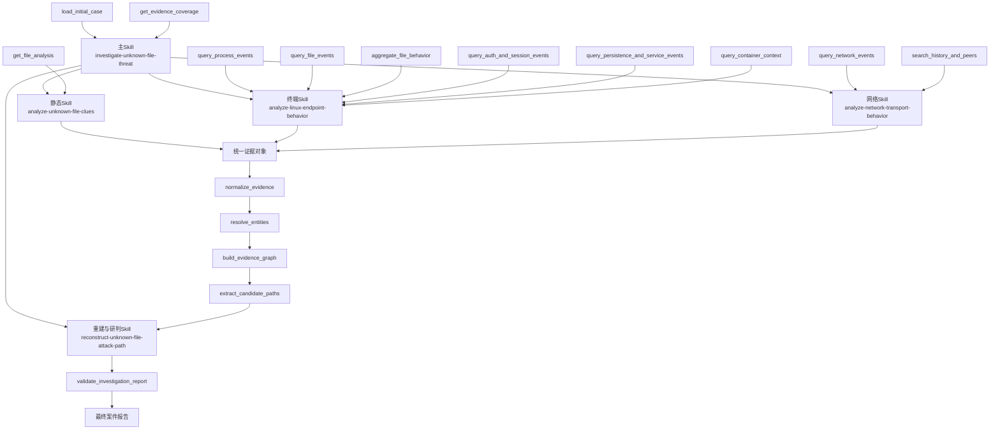
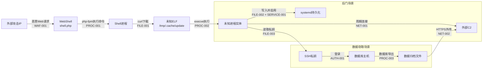

# Linux 未知文件威胁智能研判与攻击路径还原 Agent：端到端方案

> 版本：v1.0  
> 日期：2026-07-28  
> 用途：项目立项和方案汇报  
> 当前结论：建议立项，先完成数据可用性验证和最小闭环，再进入 Skill 与生产 Agent 开发。

## 1. 汇报结论

建议建设一个面向 Linux 未知文件的威胁智能研判 Agent：

> 以 CDE 和现有检测链路发现的未知文件为锚点，优先使用 `T_FILE_DETAILS`、`T_PROCESS_CHAIN_HASH`、`T_abnormal_event_TO_REPORT_OS` 等已有数据；大模型根据每一步证据自主决定下一步需要读取什么，在授权范围内按需关联终端系统、网络传输及静态与二进制结构数据，完成跨文件、跨时间、跨主机调查，最终还原未知文件执行前、执行中和执行后的行为路径与可能的攻击路径，并判断是否构成未知后门、数据窃取或未知勒索攻击。

一句话：

```text
CDE 发现未知文件，Agent 还原未知文件的攻击路径。
```

## 2. 为什么需要建设

### 2.1 当前能力

CDE 和现有算法擅长：

- 静态文件检测。
- 黑、白、灰、未知分类。
- 基于已有规则发现单点异常。
- 输出文件、触发进程、回溯进程链和异常事件等初始上下文。

### 2.2 当前问题

现有规则检测难以完整处理：

- 未知攻击和快速变化的新变种。
- 一个攻击链被拆分成大量孤立告警。
- 同一文件在不同时间阶段的行为关联。
- 一个未知文件与其他脚本、载荷、配置和数据文件的关联。
- 相同攻击在多台主机上的传播和影响。
- 合法运维与攻击行为相似导致的高误报。
- 后门长期潜伏、低频 C2 和分阶段数据窃取。
- 后门、窃取、勒索串联形成的链式攻击。

### 2.3 Agent 的增量价值

Agent 不重新进行规则检测，而是：

- 理解现有检测结果和案件上下文。
- 主动提出调查问题。
- 识别证据缺口。
- 根据中间结果选择下一类数据。
- 动态调整时间和主机范围。
- 比较攻击解释与合法解释。
- 形成可追溯、可举证的案件级结论。

## 3. 项目目标

### 3.1 核心目标

围绕一个 Linux 未知文件回答：

1. 文件是什么，现有静态分析揭示了哪些能力线索。
2. 文件是只落盘，还是已经真实执行。
3. 文件从哪里来，由谁创建、下载、上传或释放。
4. 文件由什么用户、会话、父进程和命令执行。
5. 执行后产生了哪些进程、文件、网络、权限和系统配置变化。
6. 是否建立后门、收集和外传数据或实施勒索破坏。
7. 是否与更早时间的活动或其他主机相关。
8. 能否还原有证据支持的行为路径和候选攻击路径。
9. 是否构成真实攻击，影响范围如何，哪些步骤仍然缺证。

### 3.2 最终输出

```text
案件级 Verdict
+ 行为路径
+ 候选攻击路径
+ 证据链
+ 跨文件/跨时间/跨主机关联
+ 三场景研判
+ 时间线与事件图
+ 反证和合法解释
+ 缺失证据
+ 数据覆盖和质量
+ 影响范围
```

## 4. 项目边界

### 4.1 本项目负责

- Linux 未知文件案件的业务调查逻辑。
- 三类攻击场景的调查方法。
- 已有数据消费和补充数据诉求。
- Agent 逐步调查和范围扩展逻辑。
- 多源证据关联和攻击路径还原。
- 可解释研判和证据化输出。

### 4.2 本项目不负责

- 重做 CDE 和文件黑白灰分类。
- 替换现有检测规则。
- 建设 Kafka、数据库和样本存储系统。
- 设计通用 RAG、领域模型、Skill、MCP、记忆和权限底座。
- Windows 专属取证。
- 在普通主机上运行未知样本。
- 自动处置生产资产。
- 攻击组织归因。

底层基座视为外部公共能力，本项目只提出业务数据和调用契约。

## 5. 三个核心场景

### 5.1 未知劫持后门/远控

研判重点：

- 隐藏、伪装和删除后运行。
- 进程劫持、动态链接器和异常共享库。
- cron、systemd、SSH key、账号和启动项持久化。
- 反向连接、监听、周期回连、DNS 隧道、WebShell 和代理。
- 利用相同账号、密钥或 C2 扩展到其他主机。

### 5.2 未知数据窃取/木马

研判重点：

- 枚举主机、用户、网络、数据库和敏感目录。
- 访问业务数据、SSH 私钥、Token、证书、浏览器会话和云凭据。
- 数据库导出、数据归集、压缩、加密和暂存。
- HTTPS、SCP/SFTP、DNS、代理和云存储外传。
- 凭据窃取后的跨主机访问。

### 5.3 未知勒索

研判重点：

- 大量、高频文件读取、改写、重命名、删除和加密。
- 数据库、备份、安全和业务服务停止。
- LVM、Btrfs、ZFS、云盘、虚拟化或备份快照破坏。
- 恢复配置、挂载卷和共享存储破坏。
- 勒索信和多主机同步影响。

### 5.4 链式攻击

```text
后门潜伏
→ 凭据访问和横向扩展
→ 数据发现、归集和外传
→ 破坏备份和关键服务
→ 批量加密与勒索
```

三个场景是调查范围，不是三套固定规则。

## 6. 端到端业务架构

```text
┌──────────────────────────────────────┐
│ 1. CDE 与现有检测链路                │
│ 未知文件 + 三张表/等价 JSON           │
└──────────────────┬───────────────────┘
                   ↓
┌──────────────────────────────────────┐
│ 2. 初始案件构建                       │
│ 文件锚点 + 主机 + 时间 + 已有上下文    │
└──────────────────┬───────────────────┘
                   ↓
┌──────────────────────────────────────┐
│ 3. Agent 调查决策                     │
│ 事实 + 假设 + 证据缺口 + 下一步选择    │
└──────────────────┬───────────────────┘
                   ↓
┌──────────────────────────────────────┐
│ 4. 三层数据按需获取                   │
│ 终端系统 + 网络传输 + 静态/二进制结构  │
└──────────────────┬───────────────────┘
                   ↓
┌──────────────────────────────────────┐
│ 5. 深度关联                           │
│ 跨文件 + 跨时间 + 跨主机              │
└──────────────────┬───────────────────┘
                   ↓
┌──────────────────────────────────────┐
│ 6. 案件重建                           │
│ 时间线 + 事件图 + 行为路径 + 攻击路径  │
└──────────────────┬───────────────────┘
                   ↓
┌──────────────────────────────────────┐
│ 7. 研判输出                           │
│ Verdict + 三场景 + 证据/反证/缺证      │
└──────────────────────────────────────┘
```

### 6.1 端到端总体流程图



### 6.2 Agent内部调查循环



### 6.3 Skill和工具调用关系



### 6.4 攻击链还原示例



## 7. 输入方案

### 7.1 已确认的初始输入

#### `T_FILE_DETAILS`

- 文件 Hash、路径、类型、大小和权限。
- 文件创建、修改、访问和发现时间。
- 文件属主和 UID/GID。
- 触发进程、PID、PPID、UID/EUID、进程创建时间。
- `DETAIL` 回溯进程链。
- 用户、访问 IP、登录账号。
- 主机、资产、Pod 和容器。
- 落盘/启动类型和 HOFS 样本引用。

#### `T_PROCESS_CHAIN_HASH`

- 进程链文件 Hash。
- Hash 信誉。
- PID 和进程名。

#### `T_abnormal_event_TO_REPORT_OS`

- 异常事件和文件/进程上下文。
- IP、端口、攻击阶段和状态。
- 发生、检测和上报时间。
- 用户、主机和 Pod。
- 上游置信度、次数和持续时间。

### 7.2 初始输入的定位

三张表是 Agent 已有输入，不应重复采集。但需要确认：

- 字段来源和真实语义。
- 原始采集、快照、聚合或推断属性。
- `DETAIL` 顺序、深度和完整性。
- 网络字段能否绑定进程。
- 文件时间是否有事件主体。
- 数据保留和历史查询能力。
- 原始证据引用能力。

## 8. 补充数据方案

### 8.1 终端系统层

回答：未知文件在真实 Linux 环境中是否执行、具体做了什么。

P0 数据：

- 稳定主机 ID、Boot ID、进程实体和容器身份。
- 进程创建、执行、父子关系、命令行、用户和会话。
- 文件创建、读取、写入、重命名、权限变化、删除和执行。
- SSH、PAM、sudo、账号、组、密钥和权限变化。
- systemd、cron、at、启动配置和服务启停。
- 动态链接器、内核模块、挂载、备份、快照和共享存储。
- 容器、Pod、镜像、宿主 PID 和挂载关系。
- Web、数据库、发布、备份和合法运维记录。
- 高频文件操作、影响目录、CPU 和磁盘 I/O 聚合。

### 8.2 网络传输层

回答：相关进程与谁通信，是否 C2、外传或跨主机。

P0 数据：

- 带进程归属的 connect、accept、listen 和 close。
- DNS 查询和响应。
- 五元组、方向、持续时间和收发字节。
- HTTP/HTTPS、TLS 和代理元数据。
- 防火墙、IDS/IPS、WAF 和 Web 日志。
- SSH、SCP、SFTP 和 NetFlow。
- 容器和 Pod 出站连接。
- 云和对象存储访问审计。

关键要求：

```text
网络事件尽可能包含 process_entity_id。
```

只有 IP/端口而没有进程归属时，只能作为线索。

### 8.3 静态与二进制结构层

回答：未知文件是什么、可能具备什么能力。

- 优先开放 CDE 和现有算法的结构化输出。
- 文件元数据、Hash、样本引用、软件包和签名。
- ELF 架构、入口、段、节、依赖、符号、字符串和混淆。
- 脚本语言、解释器、编码、命令、文件、网络、持久化和外传线索。
- 每项发现的偏移、函数、行号或原始引用。

静态分析只能产生调查线索，不能证明真实行为已经发生。

## 9. Agent 调查机制

### 9.1 调查状态

Agent 持续维护：

- 已知事实。
- 候选假设。
- 反证方向。
- 证据缺口。
- 当前时间窗口。
- 当前主机和关联主机范围。
- 已调用的数据能力。
- 停止条件。

### 9.2 调查循环

```text
读取当前证据
→ 判断最关键的未知问题
→ 选择相应数据能力
→ 获取最小必要数据
→ 更新事实、假设和反证
→ 判断是否跨文件、扩时间或跨主机
→ 继续或停止
```

### 9.3 非固定流程

```text
父进程是 php-fpm
→ 优先查询 Web/WAF

父进程是 sshd/bash
→ 优先查询认证和会话

发现 SSH 私钥访问
→ 查询后续跨主机登录

发现数据压缩
→ 查询输入文件和出站传输

发现高频文件改写
→ 查询服务、备份、快照和影响范围
```

下一步由当前证据决定，不预先写死完整攻击路径。

## 10. 三种深度关联

### 10.1 跨文件

关联未知文件与：

- 创建和下载脚本。
- 父文件、压缩包和释放文件。
- 子载荷和配置。
- 敏感输入文件和暂存文件。
- 持久化文件和勒索信。

### 10.2 跨时间

- 向前追溯入口、落地、登录和潜伏。
- 向后追踪执行、外联、持久化、窃取和破坏。
- 查询历史同 Hash、路径、命令、账号、C2 和周期行为。

### 10.3 跨主机

沿以下实体扩展：

- 相同文件和 Hash。
- 相同 C2、IP、域名和 DNS。
- 相同账号、SSH key 和 Token。
- 相同命令、脚本和持久化。
- 相同镜像、Pod 模板和共享存储。
- 相同勒索信和破坏模式。

无跨主机线索时不盲目查询所有资产。

## 11. 路径重建和研判

### 11.1 行为路径

只描述已观察或可靠关联的行为：

```text
sh 创建未知文件
→ 未知文件被执行
→ 进程连接外部 IP
→ 进程写入 systemd 配置
```

### 11.2 攻击路径

在行为路径基础上结合入口、上下文和意图：

```text
攻击者通过 WebShell 获得命令执行
→ 下载并执行未知后门
→ 建立 C2
→ 创建 systemd 持久化
```

入口缺证时，应输出“已确认行为路径 + 候选攻击路径 + 缺失步骤”，不能编造完整故事。

### 11.3 证据状态

- `observed`：直接观察。
- `correlated`：通过稳定实体可靠关联。
- `inferred`：基于多条证据推断。
- `unknown`：缺少证据。

### 11.4 Verdict

建议：

```text
confirmed_attack
likely_attack
suspicious_unconfirmed
likely_benign
insufficient_evidence
```

Verdict、置信度、严重性、文件状态和 TTP 必须分开。

## 12. 可行性分析

### 12.1 总体结论

方案业务和技术上可行，但效果由数据能力决定。

### 12.2 已有基础

- CDE 提供稳定的未知文件入口。
- 三张表提供文件、进程链、异常事件、用户、资产和容器上下文。
- 已有字段映射、Schema、样例 JSON 和早期 Python MVP。
- 已完成 Linux 证据源和三场景采集需求分析。

### 12.3 成功前提

- 能证明进程真实执行。
- 能获取文件运行时行为。
- 网络事件可以尽可能归因到进程。
- 支持历史和跨主机查询。
- 有稳定主机和进程身份。
- 返回原始证据和数据覆盖情况。

### 12.4 数据不足时的能力降级

| 缺失数据 | 影响 |
| --- | --- |
| 进程执行事件 | 无法可靠证明未知文件运行 |
| 文件运行时事件 | 无法证明勒索加密、敏感读取和数据归集 |
| 进程网络归属 | 无法可靠证明后门 C2 和外传主体 |
| 认证事件 | 无法还原账号入口和跨主机路径 |
| 历史查询 | 无法完成真正的跨时间分析 |
| 跨资产查询 | 无法完成跨主机分析 |
| 数据覆盖说明 | “没有发现”不能作为强反证 |

## 13. 分阶段落地

### 阶段一：立项和数据可行性

目标：

- 确认三张表真实字段和语义。
- 盘点终端、网络和静态数据。
- 形成已有/部分/缺失矩阵。
- 确认历史和跨主机查询能力。
- 选择三个代表性案件。

交付：

- 现有数据盘点。
- 三层采集诉求。
- 三场景覆盖矩阵。
- 数据缺口和优先级。
- 端到端方案评审稿。

### 阶段二：最小闭环原型

目标：

- 使用一个后门、一个窃取、一个勒索案件。
- 从三张表启动。
- 按需读取模拟或脱敏真实数据。
- 验证跨文件、跨时间、跨主机调查。
- 输出可举证路径和 Verdict。

不要求：

- 全量生产接口。
- 通用底层基座建设。
- 自动响应处置。

### 阶段三：能力工程化

- 冻结输入、证据和输出契约。
- 接入真实数据查询能力。
- 实现正式 Skill 和 Agent 编排。
- 建立场景测试集和评测指标。
- 增加查询预算、权限和审计约束。

### 阶段四：试点与生产化

- 选择限定资产试点。
- 与安全工程师并行研判。
- 评估准确性、召回、调查时间和证据完整性。
- 根据试点结果逐步扩大范围。

## 14. 验收指标

### 14.1 业务指标

- 未知文件案件平均调查时间下降。
- 高风险未知文件优先级排序有效。
- 相比单点告警降低误报。
- 能发现规则未直接命中的隐蔽关联。
- 能识别多阶段和多主机攻击。

### 14.2 能力指标

- 能从三张表启动调查。
- 能证明或否定文件执行。
- 能完成至少一次跨文件关联。
- 能完成至少一次历史时间扩展。
- 有线索时能完成跨主机扩展。
- 能同时输出支持证据和反证。
- 数据不足时输出 `insufficient_evidence`。
- 每个关键路径步骤都能引用原始证据。

### 14.3 安全指标

- 不在普通主机运行未知样本。
- 不允许不受控任意 Shell。
- 不把日志或样本内容当作系统指令。
- 不因单个 IOC 或 ATT&CK 标签确认攻击。
- 不在研判阶段自动修改生产资产。

## 15. 主要风险与应对

| 风险 | 应对 |
| --- | --- |
| 运行时数据不足 | 先做数据盘点和最小采集闭环 |
| PID重用导致错链 | 使用主机、Boot ID、PID和启动时间 |
| 网络无法归因进程 | 降低证据强度，推动进程网络关联 |
| 时间漂移导致错序 | 统一时间、保留时区、NTP和Boot ID |
| 大模型编造路径 | 强制证据ID、状态分级和缺证输出 |
| 查询范围失控 | 最小必要查询、时间窗和主机范围控制 |
| 合法行为误判 | 强制查询发布、备份、运维和历史基线 |
| 海量文件事件成本高 | 原始事件 + 聚合视图 + 代表性样本 |

## 16. 当前需要决策的问题

立项会议需要确认：

1. 是否认可“CDE 检测 + Agent 案件研判”的职责边界。
2. 是否认可 Linux-only 和三个核心场景。
3. 是否认可跨文件、跨时间、跨主机作为核心差异化能力。
4. 三张表能否作为正式初始输入。
5. 哪些终端和网络运行时数据已经存在。
6. 哪些 P0 数据允许新增采集。
7. 历史和跨主机查询的保留范围。
8. 是否允许使用脱敏真实案件完成最小闭环验证。
9. 一期是否以“数据可行性 + 三案件原型”为目标。
10. 各数据和接口的责任团队。

## 17. 建议汇报结构

汇报时建议按以下顺序：

1. 当前规则检测的痛点。
2. Agent 相比 CDE 的增量价值。
3. 项目目标和三类场景。
4. 端到端流程。
5. 三张表和三层补充数据。
6. 跨文件、跨时间、跨主机示例。
7. 可行性和数据依赖。
8. 分阶段落地计划。
9. 验收指标。
10. 需要会议确认的事项。

## 18. 推荐的汇报结束语

> 本方案不替代 CDE，也不重复建设静态检测能力。CDE 负责发现未知文件，Agent 负责以未知文件为锚点，利用已有表数据和按需补充的运行时证据，完成跨文件、跨时间、跨主机的案件级智能推理。项目首先聚焦未知后门、数据窃取和未知勒索三个场景，以数据可行性和最小闭环验证为第一阶段目标；验证通过后，再进入正式 Skill、Agent 编排和生产化建设。
