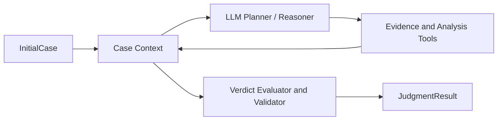

# Judgment Engine Design

## 内部结构

LLM、调查知识、工具、案件上下文和结论校验共同构成研判引擎，不额外设置一个独立的“调查领域服务”。

## 职责分配

### LLM

- 理解告警和案件上下文；
- 形成候选假设；
- 选择下一项调查；
- 识别证据冲突和需要补充的信息；
- 基于已验证结果生成解释。

### 确定性能力

- 时间、实体、进程树和数据对象关联；
- 周期、熵、数量、顺序和阈值计算；
- Evidence 到 Fact/Finding/Relation 的转换；
- Verdict 最低门槛和引用完整性校验。

## 状态

案件上下文保留 `Entity`、`Claim`、`Evidence`、`Fact`、`Finding`、`Relation`、`Hypothesis`、`EvidenceGap`、`Coverage`、工具调用和模型决策。生产实现应持久化状态，并采用显式状态转换或事件记录，避免任意模块直接修改全部字段。

## 扩展方式

场景能力应逐步收敛为版本化能力包，包含场景需求、工具依赖、Analyzer、Verdict 规则和回归 Case。当前中心化 Python 注册表是原型实现，不是最终插件架构。
