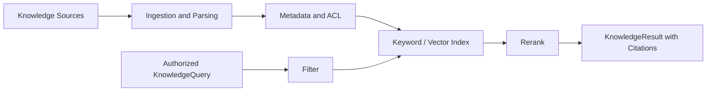

# RAG Knowledge Design

## 知识域隔离

- Investigation：ATT&CK、威胁情报、厂商文档、取证方法和数据字段说明。
- Response：企业 SOP、审批矩阵、证据保全、执行手册和回滚规则。
- Case Memory：已关闭案件、误报、处置效果和复盘。

不同知识域采用独立索引或强制元数据过滤。处置循环默认优先检索组织政策，研判循环默认优先检索调查方法。

## 接入两个循环

研判检索结果标记为 `investigation_guidance`，只能用于提出假设和选择工具。处置检索结果标记为 `response_policy` 或 `operational_guidance`，可以支撑 ResponsePlan，但仍需验证目标资产和政策适用条件。

## 可观测性

记录查询、过滤条件、候选文档、最终片段、重排序分数、模型使用情况和用户反馈。敏感片段的审计记录遵循最小暴露原则。
