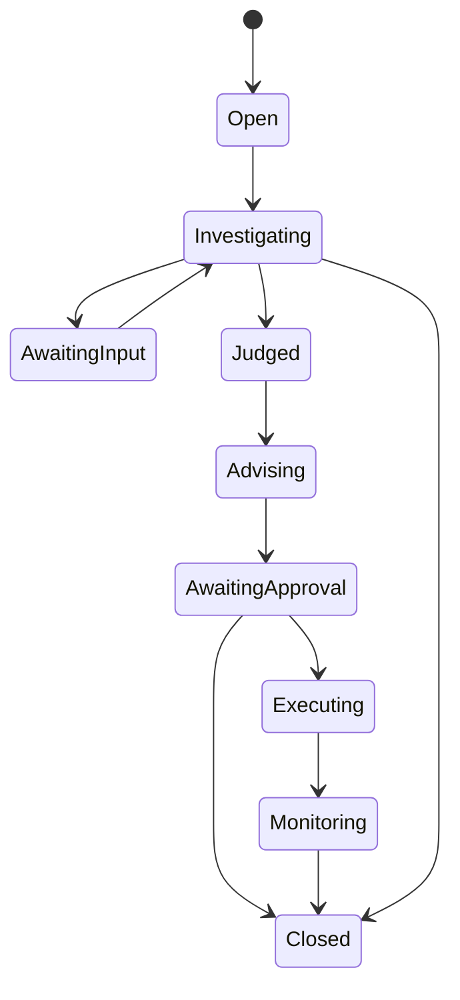

# Case Governance Design

## 组件

- Case Store：案件聚合、版本和并发控制。
- Run Scheduler：研判和处置任务的队列、租约、重试和预算。
- Authorization Service：身份、角色、数据 Scope 和动作权限。
- Approval Service：审批请求、超时、拒绝和职责分离。
- Audit Store：追加式运行记录和证据引用。
- Execution Gateway：向 SOAR、EDR、IAM 等系统提交经批准动作。

## 一致性

案件状态更新使用乐观并发或事件序号。工具调用与状态写入使用幂等键；外部执行采用提交、查询状态和补偿流程，不假设分布式事务。

## 当前实现

`CaseGraph` 负责案件阶段、Scope 审批、处置审批和结果发布，并把编译后的研判图与处置图直接作为子图节点。内存和 SQLite Checkpointer 已实现；生产 Case Store、任务调度、身份服务、追加式审计和 Execution Gateway 仍是目标能力，不应误认为已经交付。
