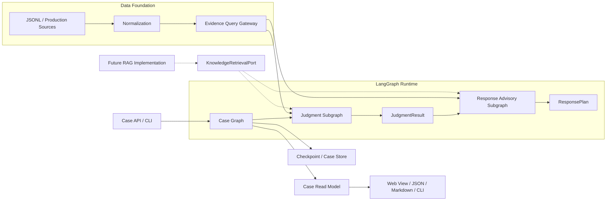
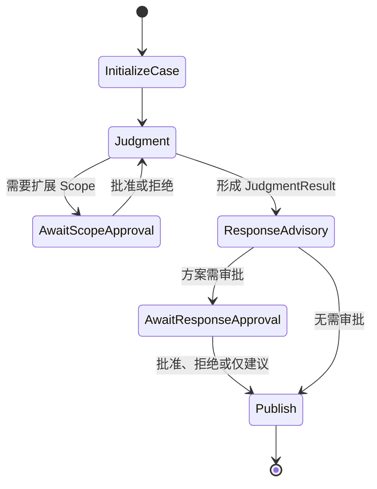
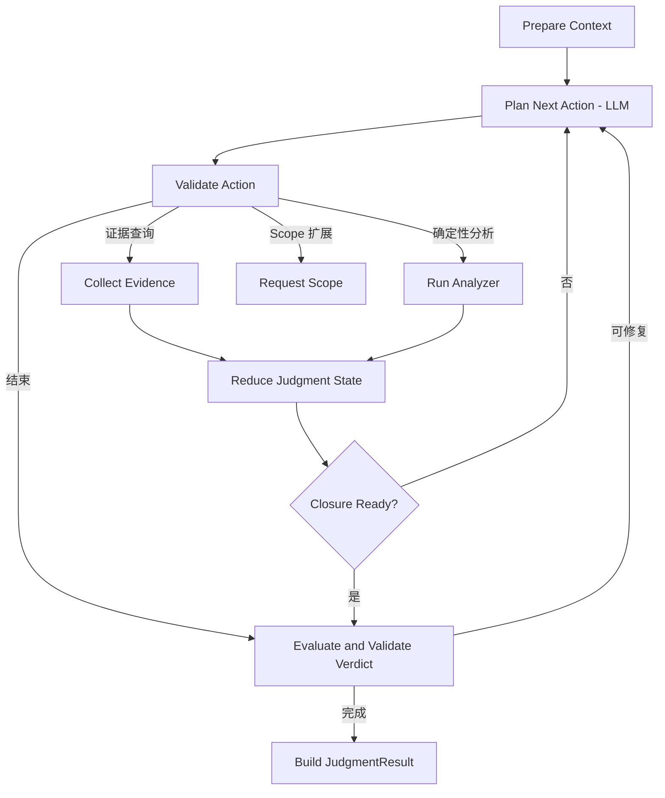
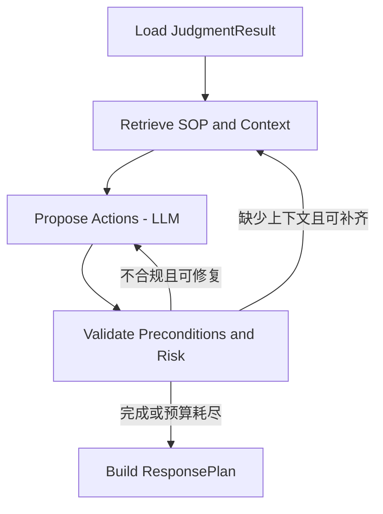

# Platform Architecture Migration Design

## 1. 设计结论

系统采用按业务能力纵向组织的模块化单体。LangGraph 接管流程运行时，不接管证据语义、研判规则和处置策略。

手写循环已由研判子图替代，处置建议作为第二个子图运行。`CaseGraph` 直接挂载两个编译后的子图，负责案件阶段、人工中断和结果发布；公共契约、数据底座和展示层已与研判内部状态解耦。

## 2. 目标结构



数据查询、模型调用和状态持久化均通过端口访问。RAG 本次只保留 `KnowledgeRetrievalPort`，由 Null Adapter 返回“能力未配置”；具体知识实现后续单独设计。

## 3. LangGraph 工作流

### 父图



父图保存案件标识、生命周期、研判状态边界、`JudgmentResult`、`ResponsePlan` 和审批摘要。父图与研判子图共享 `investigation` 通道，父图与处置子图共享 `judgment_result` 和 `response_plan` 通道；动作、路由、知识结果和修复信息等子图内部字段不会提升为案件公共状态。

### 研判子图



Planner 使用结构化输出生成动作，LangGraph 条件边负责路由。Policy 校验失败、工具失败和 Verdict 修复分别进入明确分支，不再依赖一个大循环中的 `continue`。

### 处置建议子图



处置 LLM 只看到发布后的 `JudgmentResult`、经授权的资产/业务上下文和可选知识上下文。没有 RAG 实现时必须按知识不可用处理，策略校验仍负责动作白名单、审批等级、可逆性、证据保全和必填字段。

## 4. 状态与更新规则

LangGraph 状态使用轻量图状态包装现有领域对象。节点在修改前复制 `InvestigationState`，然后以覆盖方式提交更新；领域对象继续由 Pydantic 校验。当前实现未把 InvestigationState 的每个集合拆成独立 reducer，后续只有在需要并行节点写入时才进行字段级拆分。

| 状态 | 所有者 | 更新方式 |
|---|---|---|
| `CaseGraphState` | 父图 | 保存案件阶段和两个子图的共享边界字段 |
| `JudgmentGraphState` | 研判子图 | 复制并覆盖提交 InvestigationState，内部维护动作和路由 |
| `ResponseGraphState` | 处置子图 | 内部维护上下文、候选方案、校验结果和循环预算 |
| Checkpoint | LangGraph Checkpointer | 以 `tenant_id/case_id/run_id` 定位，持久化每步快照 |
| Case Read Model | 案件提交边界 | 案件管理将内部状态提交为稳定契约，展示层只读 |

`InvestigationState` 只存在于案件管理与研判边界，不进入数据底座、公共契约或展示模块。子图节点不得原地修改输入实例后继续传播，必须提交复制后的状态。

## 5. 关键端口

| 端口 | 作用 | 首版适配器 |
|---|---|---|
| `EvidenceQueryPort` | 查询规范化遥测并返回 Coverage | 现有 JSONL/Fixture Repository 包装器 |
| `KnowledgeRetrievalPort` | 预留知识查询契约 | Null Adapter；具体实现后置 |
| 研判 Planner 协议 | 研判循环结构化规划 | 确定性 Planner / 结构化 ChatModel Planner |
| 处置 Planner 协议 | 处置循环结构化规划 | 确定性 Planner / 结构化 ChatModel Planner |
| `ResponseContextPort` | 查询资产和业务上下文 | Null Provider；生产实现后置 |
| LangGraph Checkpointer | 保存和恢复图状态 | 开发内存/SQLite，生产实现后置 |
| `CaseReadStore` | 向展示层提供稳定案件视图 | 进程内实现 |

`EvidenceQueryPort` 与 `KnowledgeRetrievalPort` 必须是两个接口：前者返回可用于证明案件事实的 Evidence，后者返回只可用于推理引导或政策依据的 KnowledgeResult。

## 6. 代码目标边界

```text
src/threat_agent/
├── bootstrap/          # 配置、依赖组装和 CLI
├── contracts/          # 跨模块稳定 DTO
├── case_management/    # 父图、审批、Checkpoint 和结果提交
├── data_foundation/    # 查询端口与数据源适配器
├── judgment/           # 研判领域、应用流程和工具适配器
├── response_advisory/  # 处置领域、应用流程和上下文端口
├── knowledge/          # RAG 端口与 Null Adapter
├── presentation/       # 只读 API、Store 和契约序列化
└── shared/             # 无业务含义的基础类型
```

每个业务能力内部按需使用 `domain`、`application`、`ports` 和 `adapters`。不为满足目录形式创建无行为的占位文件；公共代码进入 `shared` 前必须证明其没有业务含义。

## 7. 迁移结果与剩余工作

迁移后的默认入口位于 `bootstrap/cli.py`，代码使用 `src` 布局。黄金 Case 保持原有研判语义，架构测试检查公共契约、数据底座和展示层的依赖方向。

- 已完成：原生双子图、模块化代码边界、独立模型配置、处置上下文端口、RAG 空实现和只读展示。
- 保留：领域模型、场景、Tools、Analyzers、Policy、Verdict、Fixture 和黄金 Case。
- 后续建设：生产 Case Store、审计、身份服务、业务上下文 Adapter、数据源连接器和 RAG 实现。

具体历史批次和验收门槛见 [implementation-plan.md](implementation-plan.md)。

## 8. 展示架构

展示层不读取 `InvestigationState` 或 LangGraph checkpoint。`CaseReadModel` 将内部状态投影为稳定结构：案件摘要、Verdict、攻击路径、证据与 Coverage、调查时间线、处置方案、审批状态、知识引用和限制。

首版 Web 视图为只读，用于证明架构闭环；继续支持 JSON、Markdown 和 CLI。审批输入通过案件 API 恢复 interrupt，不由页面直接修改图状态。

## 9. 可靠性与安全边界

- 具有外部副作用的节点必须使用幂等键；interrupt 之前的副作用必须可安全重放。
- 模型输出先做 Schema 校验，再做领域 Policy 校验。
- Checkpoint 保存流程状态，不替代证据原文存储和审计记录。
- 知识 ACL、数据 Scope 和动作权限分别校验，不因进入同一案件而合并授权。
- 记录模型版本、提示版本、工具输入摘要、知识引用、节点耗时和失败类型。
- Checkpoint 和状态 Schema 变更必须提供版本与迁移策略，避免悬挂案件无法恢复。

## 10. 主要风险

| 风险 | 控制方式 |
|---|---|
| 图状态与现有可变状态双轨导致语义漂移 | 使用单向转换器和黄金 Case 差异测试，逐字段定义 reducer |
| 双循环放大延迟和模型成本 | 独立预算、结果缓存、结束条件和确定性短路 |
| 后续 RAG 实现污染案件证据 | 预先隔离端口和 ID 类型，Verdict Validator 只接受 Evidence ID |
| 恢复执行造成重复查询或副作用 | Checkpoint、幂等键和节点级重试边界 |
| 首版范围演变为数据湖或 SOAR 建设 | 以端口和本地适配器交付，生产基础设施单独立项 |

## 11. 已落实的设计取舍

1. 采用模块化单体渐进迁移，不先拆微服务。
2. LangGraph 负责编排与持久化语义，领域判断继续由现有模型、Analyzer、Policy 和 Validator 负责。
3. 双循环由父图串联，只通过 `JudgmentResult` 传递已发布研判结果。
4. RAG 与数据查询严格分离，本次只保留端口和 Null Adapter，不实现检索。
5. 首版展示为只读案件视图，并保留 JSON/Markdown/CLI 兼容。
6. 实际处置执行和生产级数据湖不进入本次迁移范围。

## 12. 技术依据

LangGraph 的 State/Node/Edge、reducer、checkpoint、interrupt 和 subgraph 能力与本设计所需的循环路由、局部状态更新、恢复执行和人工审批相匹配：

- [Graph API](https://docs.langchain.com/oss/python/langgraph/graph-api)
- [Persistence](https://docs.langchain.com/oss/python/langgraph/persistence)
- [Interrupts](https://docs.langchain.com/oss/python/langgraph/interrupts)
- [Subgraphs](https://docs.langchain.com/oss/python/langgraph/use-subgraphs)
- [Structured output](https://docs.langchain.com/oss/python/langchain/structured-output)
