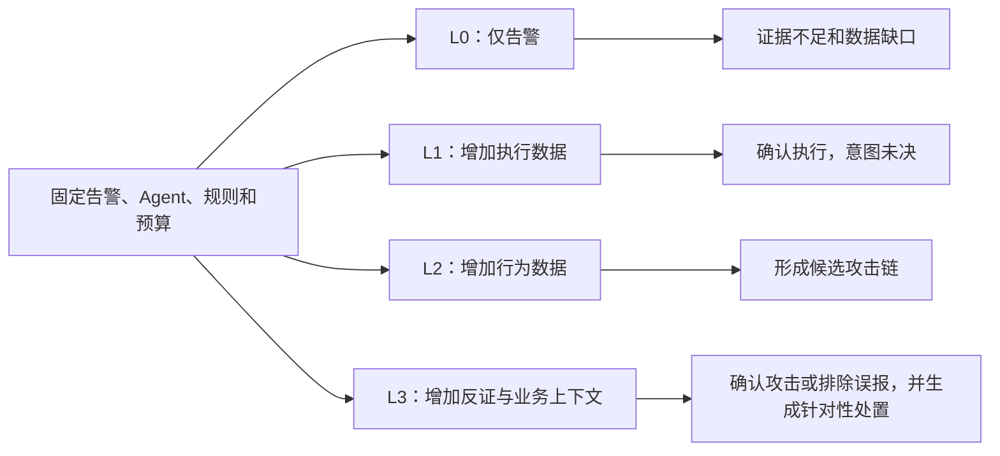
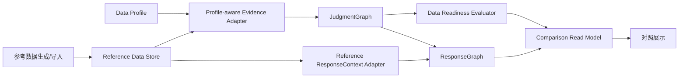

# Data-Driven Investigation Quality Demo Design

## 1. 设计结论

Demo 采用“受控变量实验”：固定 Agent 和案件告警，只切换数据 Profile。展示重点不是模型置信度，而是新增数据源解锁了哪些可验证事实、哪些问题仍被 Coverage 阻塞，以及完整反证如何避免误报。

参考数据底座使用本地关系型存储承载统一数据模型，通过现有 Port 服务研判和处置。该实现是生产数据底座的契约样板，不是生产数据湖的替代品。

## 2. 实验结构



每个基础案件包含一份完整数据集。Profile 只控制查询可见性和 Coverage，不复制或修改告警。恶意与合法案件分别运行四级实验，避免把“更多数据”错误表达成“更恶意”。

| 等级 | 数据能力 | 可回答问题 |
|---|---|---|
| L0 | 告警、文件锚点 | 发生了什么告警 |
| L1 | 进程执行、父子关系 | 文件是否执行、由谁启动 |
| L2 | 网络、DNS、Socket、文件、持久化 | 是否形成可归因的攻击行为链 |
| L3 | 软件来源、运维基线、资产与业务上下文 | 是否存在合法解释、应如何处置 |

## 3. 组件设计



### Reference Data Store

首版使用 SQLite，复用现有运行依赖并保持数据可检查。存储至少包含告警、规范化 Evidence、实体、关系、Coverage、资产上下文、数据集版本和生成元数据。

### Data Profile

Profile 是版本化清单，声明数据源是否 `available`、`partial`、`empty` 或 `unavailable`，并记录限制。Profile 不修改 Evidence 内容，也不保存期望 Verdict。

### Data Readiness Evaluator

Evaluator 将场景所需 Evidence Role 与实际 Coverage 对照，形成 `DataReadinessReport`。它只判断问题是否具备回答条件，不替代 Verdict Validator，也不根据数据数量推断恶意程度。

### Reference ResponseContext Adapter

Adapter 从参考资产目录返回结构化业务上下文。L3 之外的 Profile 可以显式隐藏部分上下文，用于展示缺少资产信息时处置建议为何更保守。

## 4. 关键数据契约

`DataProfile` 至少包含：

```text
profile_id
dataset_version
visible_sources
coverage_rules
asset_context_visible
description
```

`DataReadinessReport` 至少包含：

```text
tenant_id / case_id / run_id
profile_id / dataset_version
available_sources / missing_sources
answerable_questions / blocked_questions
coverage_summary
recommended_capabilities
limitations
```

报告中的问题必须引用 Evidence Role 或场景要求，推荐能力必须说明预期解锁的问题，不能只罗列数据源名称。

## 5. 展示设计

主页面按决策顺序展示：

1. 固定条件和当前数据 Profile；
2. 数据源 Coverage 矩阵；
3. 可回答问题与受阻问题；
4. 新增事实、发现和攻击路径；
5. 反证及其对 Verdict 的影响；
6. 资产上下文、处置建议和审批要求；
7. L0 至 L3 的并排差异。

同一数据源的状态采用固定语义，不用颜色代替文本。页面必须显式标注“参考数据 Demo，不能代表生产效果”。

演示由三个页面组成，并通过固定步骤导航连接：

1. “事件与当前态势”说明预置事件的时间线、攻击现状、受影响资产和调查边界，区分初始告警与后续可被数据证明的事实。
2. “数据与证据条件”展示 L0～L3 各自可见的数据来源，并明确标出执行确认、进程归因、远控行为、持久化和合法性反证五类问题是否具备回答条件。技术数据源 ID 仅放在可展开明细中。
3. “AI 分析与输出”将运行过程压缩为理解告警、核验证据、形成研判和制定处置四个阶段。模型内部思考、动作选择、工具调用和结构化载荷仍保留在后端事件契约中，但不逐条进入主界面。

AI 调查完成后必须生成两份视觉和语义独立的交付物。研判报告展示结论、结论摘要、主要发现及置信度；处置方案展示方案状态、建议动作、业务影响、审批要求和剩余风险。处置建议不得嵌入研判报告或仅用动作数量代替。

数据页面同时承担售前数据澄清职责。“数据接入诉求”的主体按数据类别说明需要持续收集的具体事件或记录、本次参考测试实际提供的样例内容、对应来源和当前具备状态。最低字段、覆盖范围、保留或接入时效和研判用途作为可展开的工程明细。页面根据所选数据等级汇总已提供与待补充的数据类别，用于后续接口确认和样例数据验收，不把某个厂商产品名称当作数据要求。

研判报告除结论和发现外，还必须展示威胁类型、受影响资产、关键问题覆盖度、原始证据引用数量、当前影响、合法性反证检查、调查范围和结论限制。报告中的结论边界必须随实际数据覆盖变化，不得暗示系统观察到未接入的数据。

界面使用暖白纸张色、锈红强调色和灰绿色完成态，不使用深色控制台。用户可见的模型决策摘要、研判结论和处置建议使用简体中文；Verdict 枚举仍保持稳定英文契约，由展示层映射中文语义。

## 6. 配置设计

所有部署与运行配置由 `bootstrap` 中的类型化 `AppSettings` 统一加载。加载优先级为：

```text
CLI 显式参数 > 进程环境变量 > 项目根目录 .env > 类型化默认值
```

业务模块接收已经校验的配置对象或具体值，不自行调用 `os.getenv()`。配置的完整边界和命名见 [configuration.md](configuration.md)。

## 7. 失败与可信边界

- Profile、数据集版本或资产目录不存在时，Demo 启动失败。
- Profile 声明可用但底层无对应数据时，报告数据一致性错误，不自动改成 `empty`。
- 数据不足时不得使用 Prompt、RAG 或演示期望结果补齐事实。
- 合法反证必须来自 Evidence 查询，不能来自硬编码的案件名称。
- 演示指标只描述参考数据上的结果，不外推生产准确率。

## 8. 与现有架构的关系

- `data_foundation` 增加参考存储与 Profile-aware Adapter，不改变 `EvidenceQueryPort`。
- `response_advisory` 增加参考 `ResponseContextPort` Adapter，不改变处置图边界。
- `case_management` 发布 `DataReadinessReport` 与现有案件结果。
- `presentation` 只消费扩展后的稳定读模型。
- `bootstrap` 统一加载 `.env` 并组装 Demo Profile、存储和运行参数。
- `knowledge` 继续使用 Null Adapter，本 Feature 不实现 RAG。
