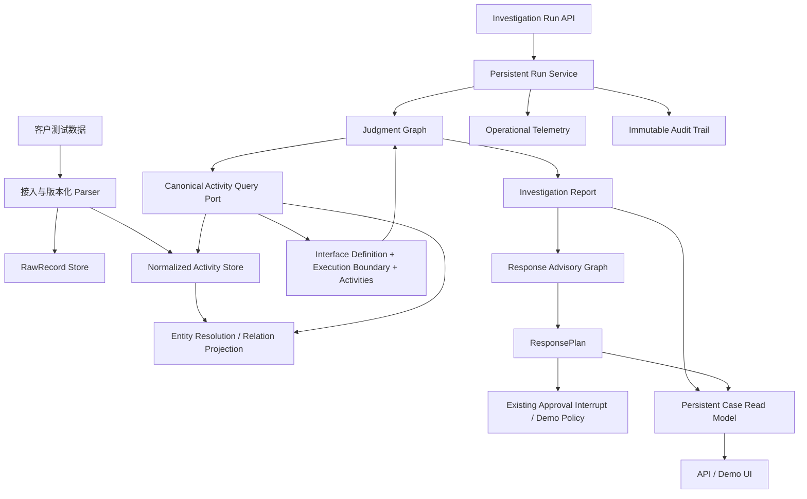
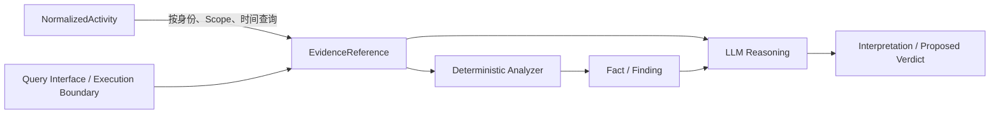
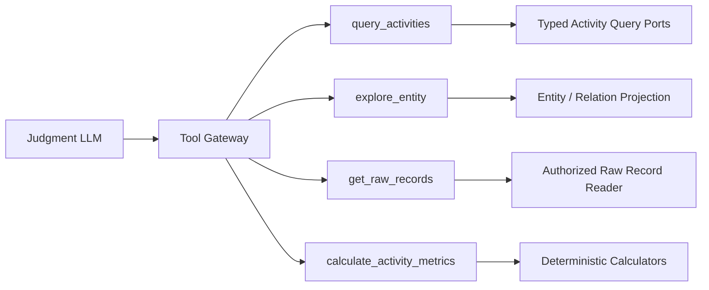
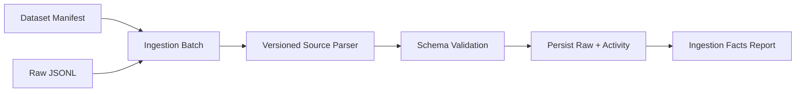

# Investigation Platform Foundation Design

## 1. 设计结论

本期采用“不可变原始记录、规范化活动、可追溯实体关系、案件 Evidence 引用、版本化分析结果”的数据主线。数据层向 LLM 交付查询接口定义、本次执行边界和实际活动，不评价数据是否充分；LLM 基于这些约束和数据形成攻击或合法解释。确定性发布门槛只负责证据引用和 Scope 一致性。

数据底座通过规范化查询端口与存储解耦。首期使用可替换的本地持久化实现完成业务闭环，并按百万级规范化活动约束索引、分页和批量写入设计，但不在本 Feature 执行容量基准测试。物理存储选型不进入研判引擎。

## 2. 总体结构



## 3. 数据语义分层

| 层 | 核心对象 | 所有权与作用 |
|---|---|---|
| L0 | `RawRecord` | 忠实保存来源载荷和接入元数据，支持追溯和重新规范化 |
| L1 | `NormalizedActivity` | 与厂商无关的客观活动，是安全数据查询的事实源 |
| L2 | `Entity`、`ObservedRelation` | 统一对象身份并表达由活动支撑的时态关系 |
| L3 | `ExternalSignal`、`Fact`、`Finding`、`Interpretation` | 保存不同生产者产生的安全语义及输入引用 |
| L4 | `EvidenceReference`、查询边界 | 将底层活动按案件 Scope 转化为证据，并交代接口定义和实际执行条件 |
| L5 | `InvestigationReport`、`ResponsePlan` | 发布版本化研判和独立处置建议 |

### 3.1 RawRecord

`RawRecord` 不要求统一载荷，但要求统一信封：

```text
tenant_id / raw_record_id / source_system / source_record_id
observed_at / ingested_at / connector_version / parser_version
payload_ref / payload_digest / access_labels
```

`payload_ref` 指向本系统保存的原始对象。首期可以使用数据库 BLOB 或受管文件目录，但领域契约不暴露路径。

### 3.2 NormalizedActivity

公共字段：

```text
tenant_id / activity_id / activity_type / schema_version
observed_at / ingested_at / source_system / source_record_id
subject_refs / actor_refs / target_refs / outcome
raw_record_ref / normalizer_version / extension
```

首期活动域：

| 活动域 | 关键语义 |
|---|---|
| Process | 创建、执行、终止和父子进程关系 |
| Network | 连接、监听、方向、端点和结果 |
| Socket | 与进程相关的收发及会话行为 |
| File | 创建、修改、重命名、删除和内容标识 |
| Service | 服务定义、启用、启动、停止和目标程序 |
| Package | 文件归属、安装来源和签名观测 |
| Asset | 主机、业务重要性、负责人和批准上下文的时态观测 |

`extension` 用于无法立即纳入标准 Schema 的特殊字段。LLM 可以读取经授权的扩展载荷，但由其产生的解释不能直接成为 Fact。

### 3.3 Entity 与 ObservedRelation

实体使用平台 ID，并保存来源标识和有效时间。Process 至少以主机、PID 和进程起始时间组合解析；File 优先使用内容摘要和文件实例信息；Host 通过来源资产 ID、云资源 ID、EDR ID 和 CMDB ID 建立别名。

关系包含：

```text
relation_id / relation_type / source_entity_ref / target_entity_ref
valid_from / valid_to / supporting_activity_refs
resolution_status / confidence / ambiguity_reason / resolver_version
```

关系状态分为 `resolved` 和 `candidate`。LLM 可以利用候选关系决定下一步查询，但调查报告不得把候选关系表述为已确认事实。

## 4. Activity、Evidence 与分析结果边界

现有 `Evidence` 将被拆分：



`EvidenceReference` 至少包含案件、运行、查询、底层对象引用和证据角色；它不复制完整原始载荷。底层活动不持有 `case_id`。

分析对象统一记录生产者类型、名称、版本、输入引用、生成时间、置信度和限制。上游 EDR 告警进入 `ExternalSignal`；确定性分析器产生 Fact/Finding；LLM 产生 Interpretation 和拟发布研判。

## 5. 查询接口和 LLM 数据边界

### 5.1 查询结果

每个活动查询返回 `ActivityQueryResult`：

```text
query_id / interface_definition / execution_boundary
activities / evidence_references
```

`QueryInterfaceDefinition` 是稳定接口说明：

```text
interface_id / interface_version / activity_types
fields(name, type, semantic, nullable)
supported_filters / correlation_keys
max_page_size / max_time_range_seconds / sort_order
```

`QueryExecutionBoundary` 记录本次查询事实：

```text
requested_scope / applied_scope
returned_count / page_limit / next_cursor
source_systems / executed_at
```

数据层不返回 `complete`、`partial`、`unsupported` 或“数据不足”等评价。返回零条只表示指定接口在本次实际执行条件下返回零条。LLM 可以继续查看接口、扩大允许范围内的查询、翻页或结合其他数据，再形成自己的判断。

### 5.2 LLM 输入与发布门槛

Prompt 不只接收记录列表，还接收查询接口定义和每次执行边界。LLM 负责检查字段、关联键、时间、Scope、分页和实际记录，形成最终威胁结论、竞争性解释、影响说明和自然语言报告。

发布校验器不替代 LLM 判黑，但必须拒绝：

- 将结论扩大到实际查询之外的主机或时间；
- 使用不存在的 Activity、Evidence、Fact 或 Finding 引用；
- 将候选实体关系表述为确认关系；

数据支持程度和空结果含义不由发布校验器代判。校验失败进入研判图的报告修复节点。

### 5.3 LLM Tool Gateway

LLM 面向稳定的数据能力工具，Tool Gateway 负责注入运行上下文、校验参数并调用内部强类型端口：

在线调查使用 LangChain 原生 Tool Calling。四个数据工具和两个流程动作均以 `StructuredTool` 注册，参数直接来自 Pydantic 输入契约的 JSON Schema；模型通过 `AIMessage.tool_calls` 选择动作，执行结果通过带相同 `tool_call_id` 的 `ToolMessage` 回灌下一轮。系统提示词只描述调查策略和数据边界，不重复手写工具字段。LangGraph 仍负责预算、Scope 审批、收敛、报告和处置阶段，Tool Gateway 仍负责注入租户、案件、运行和授权 Scope。

调查规划节点使用非思考模式、严格参数和单工具调用。该节点的职责是选择受控动作，不承担最终研判推理；关闭供应商思考模式可以避免工具历史必须回传私有推理字段的协议耦合。报告和处置节点可独立选择模型推理模式。



| 工具 | 职责 | 不承担的职责 |
|---|---|---|
| `query_activities` | 按活动类型、主机、实体、时间、专用过滤条件和游标查询活动 | 不接受 SQL，不评价空结果和数据质量 |
| `explore_entity` | 返回实体身份、确定/候选关系和相关活动时间线 | 不把候选关系升级为事实 |
| `get_raw_records` | 回溯已查询 Activity 对应的受控原始载荷 | 不读取任意路径或未进入运行证据集的记录 |
| `calculate_activity_metrics` | 计算进程树、连接间隔、传输量和文件变化摘要 | 不输出 C2、勒索或数据泄露结论 |

`query_activities` 的外层工具数量保持为一个，参数 Schema 按 `activity_type` 使用判别联合类型。Gateway 将其路由到 Process、Network、Socket、File、Service、Package、Asset 或 Extension 查询端口。新增活动域优先扩展该联合类型和内部端口，不新增场景工具。

Tool Gateway 从 `InvestigationState` 注入 `tenant_id`、`case_id`、`run_id` 和授权 Scope。模型只提供调查条件。每次成功查询产生 `EvidenceReference` 并加入本次运行的可引用对象集合；原始记录工具只能访问该集合指向的 `raw_record_ref`。

`request_scope_expansion` 和 `finish_investigation` 继续作为 LangGraph 结构化流程动作。前者只能发起现有 Scope 审批中断，后者结束取证阶段并进入报告生成，二者不与数据查询工具混用。

按场景命名的查询和分析工具只用于离线确定性测试，不作为首版在线 LLM Tool Catalog。确定性计算器可以复用纯计算逻辑，但输出必须是可验证的数值或关系，不得包含最终威胁判断。

### 5.4 聚合调查数据访问 Port

Tool Gateway 不直接依赖 SQLite Store 或单一查询 Adapter，而是依赖
`InvestigationDataPort`。该 Port 同时覆盖：

- 各活动域查询；
- 实体别名解析与关系读取；
- 受 Scope 约束的实体时间线分页；
- 已授权 Activity 对应的原始记录；
- 指标计算所需的活动批量读取。

具体 Adapter 必须统一执行数据 Profile 的来源可见性。不能只在领域查询中筛选来源，而让时间线、原始记录、关系或指标输入绕过限制。首期
`SQLiteInvestigationDataAdapter` 内部组合 SQLite 存储和查询实现；未来 EDR、
SIEM、数据湖或搜索系统只替换此 Adapter，不修改 judgment 工具网关。

## 6. 查询与物理存储

研判工具通过聚合的 `InvestigationDataPort` 使用按活动域划分的查询端口，不依赖通用字典查询或某个物理存储：

```text
ProcessActivityQueryPort
NetworkActivityQueryPort
FileActivityQueryPort
ServiceActivityQueryPort
PackageActivityQueryPort
AssetContextQueryPort
```

各端口共享 `AccessContext`、`Scope`、时间范围和 `PageRequest`。Adapter 把查询翻译到首期关系存储，未来可以替换为 KQL、湖仓、搜索引擎或其他实现。

首期物理存储分为：

- 原始记录存储：追加写、摘要校验、按租户和来源定位；
- 活动存储：按活动域、租户、时间和关键实体索引；
- 实体关系投影：可由活动重建；
- 运行与结果库：调查运行、报告、运行事件和审计；
- 展示读模型：面向 API 的稳定投影。

安全遥测存储与案件事务库保持逻辑分离，即使首期部署在同一数据库实例中也不共享领域表。

### 百万级活动假设下的取舍

首版继续使用 SQLite，原因是部署简单、可直接验证数据语义和完整调查闭环。这里的“百万级”是设计量级，不是已经获得性能证明的容量结论。

- 接入按批次事务提交，避免逐条提交造成固定开销；原始记录和规范化活动分表保存。
- 核心查询必须携带租户、活动域或主机、时间范围和分页上限；禁止在线调查发起无界全表扫描。
- 活动表保留 `(tenant_id, activity_type, observed_at)`、`(tenant_id, host_ref, observed_at)` 和来源记录索引；实体关系按来源、目标和关系类型索引。
- 分页使用 `(observed_at, activity_id)` 稳定游标，不使用深页 OFFSET；强类型细粒度过滤先由索引条件收窄，再在 Adapter 内校验。
- 运行时监控数据库文件大小、单次批量写入耗时、核心查询耗时和返回截断情况；达到业务不可接受水平时再启动存储迁移。
- 查询端口、工具参数和报告契约不暴露 SQLite。后续可将 Adapter 替换为 PostgreSQL、搜索引擎、湖仓或外部安全数据平台，LLM Tool 与 LangGraph 流程保持不变。

本 Feature 不生成百万级数据、不声明吞吐或时延指标。真实容量、数据分布、并发和保留周期确定后，通过独立性能需求制定基准数据和验收门槛。

## 7. 接入边界

首期接入采用“数据集 Manifest + 原始记录批次 + 版本化 Parser”。传输可以先支持 JSONL，但 JSONL 不是规范化数据模型。



Manifest 描述租户、来源、数据时间范围、批次、Parser、预期活动域和记录数量。导入使用来源记录 ID 与内容摘要保证幂等。失败记录进入隔离区；导入报告记录实际结果，不对质量分级。

完整 Connector、持续采集、消息队列和采集侧脱敏后续单独设计。

## 8. 正式调查报告

新增 `InvestigationReport` 作为面向用户的正式输出；现有 `JudgmentResult` 保持双循环交接契约，并逐步扩展或由其投影生成报告。

报告至少包含：

```text
report_id / report_version / case_id / run_id
verdict / threat_scenarios / executive_summary
current_situation / affected_scope / attack_path
key_findings / supporting_evidence / counter_evidence
unresolved_questions / data_boundaries / limitations
producer / model_version / prompt_version / created_at
```

页面只消费报告契约。当前根据 `datasetId` 生成影响和反证的逻辑必须删除；中文结论由后端生成，展示层只做稳定枚举和格式映射。

报告阶段位于调查工具循环之后：上下文构建器汇总本次运行产生的查询接口定义、执行边界、Activity、EvidenceReference、实体关系、Fact 和 Finding；Report Composer 生成中文结构化报告；发布校验器检查引用、Scope 和候选关系；失败时进入有限次数修复。数据充分性、空结果含义和最终威胁结论不由校验器代判。

## 9. 持久化运行与审计

### Persistent Run Service

持久化 `InvestigationRun`、图线程 ID、当前阶段、运行事件和输出结果。API 提交运行后创建持久化记录并启动现有 LangGraph 流程，不再使用进程内 `_jobs` 作为运行事实源。

Checkpoint 保存图恢复状态，运行库保存对外查询状态；二者通过 `run_id` 关联但不互相替代。本期不引入通用任务队列、取消和自动重试状态机。

### OperationalEvent

用于排障和性能分析，记录节点、模型、工具、耗时、Token、重试和错误。允许按保留策略清理。

### AuditEvent

追加写且不可由普通业务接口修改，记录操作者、动作、资源、版本、Scope、输入引用、结果摘要和关联 ID。审计事件不保存密钥，不默认复制完整原始载荷和 Prompt 内容，而保存受控引用与摘要。

## 10. 最小调查运行接口

本期只提供演示闭环需要的资源：

```text
POST   /api/investigations
GET    /api/investigations/{run_id}
```

创建接口接收案件锚点或参考数据集、数据 Profile 和运行配置；查询接口返回运行状态、对外事件、`InvestigationReport` 与 `ResponsePlan`。现有 Demo 路由作为开发期演示入口并读写同一持久化运行记录，不构成已发布 API 的兼容承诺。

LangGraph 现有 Scope 和处置审批中断继续保留。首期由 Demo 策略决定是否继续，并保存决定；不新增人工审批资源、角色权限和审批工作台，也不调用执行系统。

完整案件 CRUD、可信身份与租户授权、取消、重试、人工审批中心和多人协作状态机不属于本 Feature。

### 当前已知生产化缺口（暂缓）

以下限制描述当前本地 Demo 的已验证事实，不改变本 Feature 的目标架构，也不代表相应能力已经交付。

| 编号 | 当前事实 | 使用限制与后续触发条件 |
|---|---|---|
| CL-01：运行中任务恢复 | 运行库可保存并在重启后查询运行记录、事件和已发布产物；活跃 Demo 路径使用内存 Checkpointer 和 daemon 线程，因此进程退出时，运行中的图状态不能续跑。 | 仅可将持久化记录视为可追溯结果，不能宣称断点恢复或高可用。接入长时调查、进程重启恢复或多实例运行前，须先提供可验证的持久化状态恢复与任务接管语义。 |
| CL-02：调查 API 的身份与输出边界 | 当前 API 是开发期本地 Demo：没有可信身份、认证、RBAC 或租户授权；运行事件可能包含模型消息、工具参数、工具结果或错误，按字段名过滤密钥不能替代数据分级和展示脱敏。 | 不得将该 API 对非本机用户暴露，也不得把它作为真实敏感调查数据的访问面。接入真实数据、反向代理或多用户访问前，须先建立服务端身份、租户授权和受控输出策略。 |

## 11. 迁移影响

| 当前实现 | 目标变更 |
|---|---|
| SQLite `evidence` 直接绑定 `case_id` | 新增全局 Activity 存储和案件 EvidenceReference；参考数据迁移为导入数据集 |
| JSONL 读取时直接创建 `Evidence` | 先创建 RawRecord 和 NormalizedActivity，查询时产生 EvidenceReference |
| `EvidenceQueryPort` 返回 EvidenceBundle | 在线路径直接切换为活动查询结果；EvidenceBundle 投影仅服务离线确定性测试 |
| `_jobs` 进程内线程字典 | 持久化 InvestigationRun、运行事件和输出结果 |
| 页面按 `datasetId` 补写结论 | 只消费 InvestigationReport |
| `x-tenant-id` 作为身份 | 本期不扩展认证授权；完整可信身份边界后置 |
| LangGraph interrupt + Demo 审批策略 | 保持现有中断语义，并把策略决定写入持久化审计 |

迁移必须保持现有参考数据 Demo 可运行，使 L0～L3 数据质量对照成为新数据模型的回归样例。

## 12. 关键取舍

- 参考 Microsoft Sentinel 的原始数据保留、活动 Schema、存算解耦和派生图思想，不采用其 Azure 产品接口作为领域模型。[Sentinel Data Lake](https://learn.microsoft.com/en-us/azure/sentinel/datalake/sentinel-lake-overview)、[ASIM Normalization](https://learn.microsoft.com/en-us/azure/sentinel/normalization)
- 首期不引入图数据库；活动是事实源，实体关系是可重建投影。
- 最终威胁研判和数据充分性判断由 LLM 形成；确定性组件负责实体解析、计算、引用和实际 Scope 校验。
- 首期全部保存原始数据，但仍通过存储端口隔离物理实现。
- 首期接入从简，优先验证数据语义和调查闭环，不提前建设完整采集平台。
