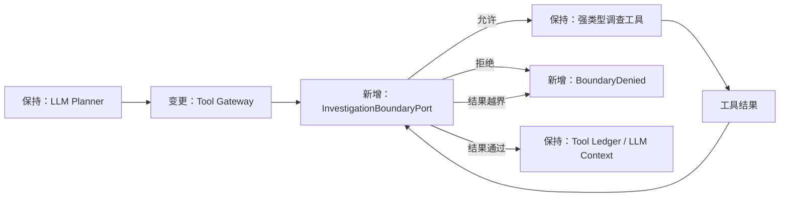

# Single-Host Investigation Boundary — Design

## 1. 设计结论

初期系统只支持“服务端固定租户、单案件主机、只读调查”。后门和勒索的本机调查能力保持完整，跨主机查询、扩域动作和审批路径从活动运行时移除。

所有调查工具通过同一个 `InvestigationBoundaryPort` 执行调用前授权和结果后校验；数据底座继续保留自身 Scope 校验，形成应用边界与数据边界的双层约束。跨主机线索只能进入报告限制，不能触发目标侧查询或形成传播事实。

本 Feature 不建设登录、RBAC 或 IAM，也不保留不可用的多主机开关和休眠流程。未来恢复跨主机调查时必须另立 Feature，在现有边界端口后增加多主机策略，而不是把权限判断重新散落到工具中。

## 2. 要解决的问题

初期目标是让 Agent 自主查询告警主机上的进程、文件、网络、Socket、服务、软件包和资产数据，完成后门、勒索的本机证据闭环。跨主机传播和全网影响面不属于当前验收范围。

当前实现与该目标存在四项错配：

| 问题 | 影响 |
|---|---|
| 工具各自实现部分边界校验 | 新增工具容易遗漏规则，授权强度不一致 |
| `explore_entity` 未校验运行来源和主机归属 | 实体导航可以绕过主机 Scope |
| 跨主机扩域、审批和恢复路径已进入运行图 | 增加非目标复杂度，并产生尚无身份授权支撑的能力 |
| 最大查询时间固定为告警前约 15 分钟 | 后门持久化、低频 C2 和勒索前置活动可能落在窗口外 |

Prompt 对模型的行为约束不能代替后端边界控制。目标状态是：Agent 在唯一告警主机和授权时间内保持自主调查，任何工具都不能访问其他主机、越界时间、未授权数据域或非本运行引用。

## 3. 范围

### 3.1 本期交付

- 服务端提供唯一 `tenant_id`，并贯穿 Case、Run、工具、报告、处置方案、事件和审计；
- 每个运行只允许一个不可变的告警主机；
- 统一工具调用前授权、结果后校验和稳定拒绝语义；
- 修复实体探索边界，维护本运行可探索的实体集合；
- 移除活动运行时中的跨主机扩域和审批路径；
- 将最大回看时间改为部署配置；
- 保持本机后门、勒索检测回归不退化。

### 3.2 非目标

- 用户登录、Token、角色、用户组、租户管理员和外部 IAM；
- 数据平台行级 RBAC；
- 跨主机传播确认、全网影响面和多主机处置；
- 通用审批中心；
- 具有副作用的生产处置执行。

## 4. 架构方案

### 4.1 职责归属

| 组件 | 职责 | 不承担 |
|---|---|---|
| `case_management` | 实现 `SingleHostBoundaryPolicy`，解释案件 Scope 和运行边界 | 查询数据、选择调查动作 |
| `judgment` | 定义并消费 `InvestigationBoundaryPort`，统一包围所有工具执行 | 实现身份系统、直接依赖案件治理实现 |
| `data_foundation` | 强制执行主机、时间和数据域查询条件 | 理解案件流程或模型意图 |
| `bootstrap` | 注入服务端 tenant、边界策略和具体数据适配器 | 承载业务规则 |
| `contracts` | 保存跨模块稳定 DTO 和错误码 | 依赖任何业务 Feature |

`judgment` 不得导入 `case_management`。`SingleHostBoundaryPolicy` 只依赖稳定契约，并由 `bootstrap` 注入 Tool Gateway；具体实现可通过 Python Protocol 的结构化类型满足端口。这保持现有依赖方向，避免形成案件治理与研判的循环依赖。

### 4.2 架构改进

本 Feature 必须减少而不是转移架构欠账：

- 删除 Planner、JudgmentGraph 和 CaseGraph 中活动的跨主机扩域路径，不保留永远不应进入的休眠节点；
- 将分散的应用级边界判断收敛到一个端口，新工具自动经过同一入口；
- 保留数据底座的查询校验作为独立防线，不把它上移到工作流；
- tenant 只在 Bootstrap 读取配置，业务模块不再从 Header、告警原文或环境变量选择 tenant；
- 不增加只有单一合法值的 `boundary_mode` 开关；未来能力存在时再引入模式选择；
- 多主机目标规则保留在设计文档中，当前运行代码不为未交付能力预埋分支。

## 5. 边界规则

### 5.1 租户与运行身份

- 初期沿用服务端 `THREAT_AGENT_DEFAULT_TENANT`；客户端 Header、告警字段和模型参数不能覆盖。
- `tenant_id/case_id/run_id` 必须与当前图状态一致。
- 数据模型和存储主键继续保留 `tenant_id`，但本期不宣称具备租户鉴权。

### 5.2 主机与时间

- Intake 必须得到唯一告警主机；缺失或多主机输入拒绝创建运行。
- `Scope.host_ids` 必须且只能包含该主机，运行期间不可变。
- 查询可以选择最大授权窗口的子区间，不得扩大窗口。
- 最大回看时间由 `INVESTIGATION_LOOKBACK_HOURS` 配置，原型建议值为 24 小时；最终默认值由检测回归和查询成本共同确定。
- 查询窗口不足时必须记录限制，不能把未查询到解释为行为未发生。

### 5.3 数据域

本机后门和勒索调查继续开放：

| 数据域 | 主要用途 |
|---|---|
| process | 执行、父子进程、远程命令、加密工具链 |
| file | 文件落地、批量变化、重命名、删除和勒索信 |
| network / socket | C2、监听、收发模式和潜在外传 |
| persistence / service | 持久化、服务变化和恢复阻断 |
| reputation / package / asset | 合法来源、批准上下文和业务影响反证 |

工具只能访问 `Scope.allowed_domains` 中的数据域。

### 5.4 实体与运行引用

`InvestigationToolLedger` 增加由确定性代码维护的 `authorized_entity_refs`：

- Intake 可映射到平台实体的本机告警锚点；
- 已授权 Activity 返回的主体、执行者和目标实体；
- 已授权实体探索返回的本机确定关系实体。

实体只有在来源属于本运行且主机归属可确定为告警主机时才可探索。候选关系或跨主机关系只保留最小线索引用和 `out_of_scope` 状态，不返回目标属性、关系扩展或目标侧时间线。

Raw Record 与 Metrics 继续只接受本运行已授权的 Activity 引用。

## 6. 工具执行契约

### 6.1 调用前

`InvestigationBoundaryPort` 在工具执行前检查：

1. tenant、case、run 与图状态一致；
2. Scope 只有唯一告警主机；
3. 工具数据域已授权；
4. 请求主机和时间没有越界；
5. Entity、Activity、Raw Record 和 Metrics 引用属于本运行；
6. 调用没有超过运行预算。

无法证明满足条件时默认拒绝。拒绝以结构化 ToolError 回灌模型，不得伪装为空查询结果。

### 6.2 结果后

工具结果进入 Ledger、事件详情和模型上下文前检查：

- tenant、host、时间和数据域符合当前 Scope；
- Entity 时间线不含其他主机活动；
- Raw Record 与 Metrics 不包含未授权 Activity；
- 所有新增实体均满足本机归属规则。

发现任一越界对象时整次调用失败，不返回经过静默过滤的“部分成功”结果。

### 6.3 稳定错误语义

| 错误码 | 含义 |
|---|---|
| `single_host_required` | Scope 不是唯一告警主机 |
| `host_out_of_scope` | 请求或结果涉及其他主机 |
| `time_out_of_scope` | 请求或结果越过最大时间窗口 |
| `domain_out_of_scope` | 工具数据域未授权 |
| `entity_not_authorized` | 实体不属于本次运行授权集合 |
| `reference_not_authorized` | 数据引用不属于本次运行 |

事件只记录工具名、错误码、Case/Run、Scope 摘要和引用 ID，不保存未授权对象内容。边界拒绝进入审计，但不表示“未发现攻击”。

## 7. 工作流与报告变化

- Planner 工具目录删除 `request_scope_expansion`，提示词只说明本机调查边界。
- JudgmentGraph 删除 `scope` 路由、`ScopeRequest` 处理和扩域状态。
- CaseGraph 删除 Scope 审批节点、恢复入口和 `awaiting_scope_approval` 状态；ResponsePlan 审批保持不变。
- 初版发布前允许删除仅服务于跨主机运行的 `ScopeRequest`、`ScopeExpansion` 等内部模型，不承诺旧 Checkpoint 兼容。
- 报告 `asserted_host_refs` 只能包含告警主机。
- 跨主机线索进入 `unresolved_questions` 或 `limitations`，不得形成目标主机感染、执行或传播事实。
- 跨主机未知不自动降级证据充分的本机后门或勒索 Verdict。

## 8. 验收门槛

### 8.1 功能与边界

- 所有 Activity 工具拒绝其他主机、越界时间和未授权数据域。
- `explore_entity` 拒绝未知、非本运行和其他主机实体。
- Raw Record 与 Metrics 拒绝非本运行 Activity。
- 任一工具返回越界对象时，结果不能进入 Ledger、事件详情或模型上下文。
- 工具目录和活动运行图中不存在跨主机扩域或 Scope 审批路径。
- 报告只发布本机结论，并明确记录跨主机限制。

### 8.2 检测回归

- 后门、勒索分别具备恶意、良性和证据不足的本机 Case。
- 增加告警前 15 分钟之外的持久化、低频 C2、勒索前置和批量变化 Case。
- 本机 Verdict、关键证据引用和反证能力不因关闭跨主机而退化。
- 含跨主机线索的 Case 不查询目标侧数据，也不确认传播。

### 8.3 架构适应度

- 依赖测试继续保证 `judgment` 不依赖 `case_management`，`data_foundation` 不依赖工作流模块。
- 架构测试确认环境配置只由 `bootstrap` 读取。
- 工具执行测试证明每个注册工具都必经同一个 Boundary Port；新增工具无法绕开且未知工具默认拒绝。
- 代码搜索和图结构测试确认跨主机工具、路由、审批状态与恢复入口已从活动运行时删除。
- Boundary Policy、Tool Gateway 和 Data Adapter 的测试分别覆盖策略、编排和数据防线，不通过端到端测试掩盖职责混杂。

## 9. 未来扩展条件

重新启用多主机前必须完成独立 Feature，至少提供：

- 可验证的调用身份和资源授权来源；
- 多主机 Scope Policy 与数据平台权限双重校验；
- 扩域依据、预算、审批权限和有效期；
- 目标侧结果后校验；
- Checkpoint 恢复和审批重放；
- 跨主机恶意、良性、证据不足和越权对照测试。

届时增加新的 Boundary Policy 和对应工作流，不修改现有调查工具的数据语义；单主机策略继续作为默认安全模式和降级路径。
