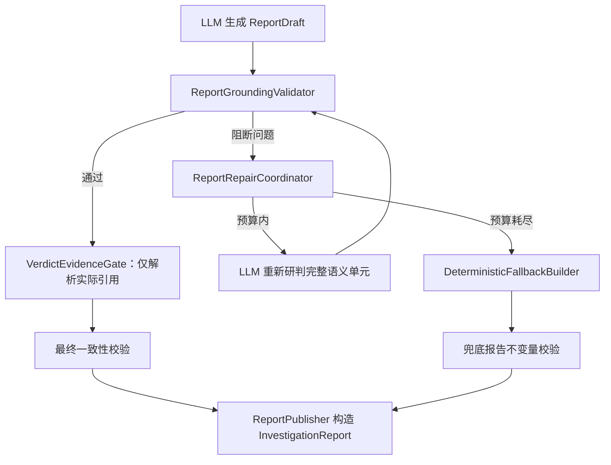

# Evidence-Grounded Report Repair — Design

## 1. 设计结论

报告中的引用、事实陈述和 Verdict 必须共同成立。未知、越界或已失效的引用属于阻断发布的语义错误，系统不得通过删除引用来保留原结论。

修复采用“受约束的重新研判”：LLM 接收校验问题和本次运行的授权证据白名单，重新生成可能受影响的报告语义，并被允许修改、降低或放弃原 Verdict。确定性代码只负责引用完整性、Scope、证据能力下限和发布状态，不替代 LLM 判断恶意性。

候选内容始终使用内部 `ReportDraft`；只有通过全部门槛后才能构造 `InvestigationReport`。修复预算耗尽时，系统发布机器可识别的 `fallback` 报告，Verdict 固定为 `insufficient_evidence`，不保留原报告的安全结论或事实断言。

## 2. 要解决的问题

当前报告链路存在四个相互放大的缺口：

| 当前行为 | 风险 |
|---|---|
| `_sanitize_report()` 过滤未知引用，但保留 Verdict 和陈述文本 | 无证据结论可以通过第二次校验 |
| `EvidenceGate` 根据整个 Tool Ledger 计算能力覆盖 | Verdict 没有引用证据，也可能借用运行中无关活动通过门槛 |
| 修复后不重新执行 `EvidenceGate` | 修复造成的证据缺失不会触发降级 |
| 最终仍有校验错误时，JudgmentGraph 仍保存报告、Verdict 并结束 | 无效候选报告被表现为正式调查结果 |

这会破坏报告最重要的可信关系：读者看到的结论无法追溯到真正支撑该结论的本次调查证据。

目标状态由以下发布不变量定义：

1. 除 `insufficient_evidence` 外，任何 Verdict 都必须具有有效支撑引用；
2. 每条实质性事实陈述必须具有有效支撑引用；
3. Verdict 的证据能力只从自身实际引用的证据计算；
4. 任一阻断问题存在时，不得构造或持久化正式报告；
5. LLM 可以重新判断结论，但不能宣布自己的输出通过校验。

## 3. 范围

### 3.1 本期交付

- 将报告校验结果改为稳定、可定位的结构化问题；
- 删除“静默删除引用并保留语义”的修复方式；
- 建立基于授权证据白名单的 LLM 重新研判流程；
- 让 EvidenceGate 仅使用 Verdict 实际引用的证据；
- 将 `ReportDraft` 与已发布的 `InvestigationReport` 分离；
- 修复耗尽后生成确定性的证据不足兜底报告；
- 对正常发布、重新研判和兜底发布提供事件与审计记录；
- 防止兜底报告触发恶意隔离、封禁等高影响处置建议。

### 3.2 非目标

- 用确定性规则判断样本恶意或良性；
- 为不存在的证据寻找“相似引用”或猜测正确 ID；
- 重新执行调查工具或自动扩大调查 Scope；
- 引入新的数据源、检测场景或人工审批系统；
- 判断证据内容是否在自然语言层面完全蕴含某条陈述。

引用存在性和证据能力下限是确定性门槛，不等同于完整的语义事实核查；最终安全判断仍由 LLM 基于授权数据完成。

## 4. 架构方案



### 4.1 职责归属

| 组件 | 职责 | 不承担 |
|---|---|---|
| `StructuredReportComposer` | 调用 LLM 生成或重新研判 `ReportDraft` | 删除非法引用、判断校验是否通过、持久化报告 |
| `ReportGroundingValidator` | 校验引用、Scope、关系状态和陈述最低引用要求 | 调用模型、修改报告、判断恶意性 |
| `VerdictEvidenceGate` | 从 Verdict 实际引用构建证据视图并检查威胁类型能力下限 | 从整个 Ledger 借用未引用证据、升级 Verdict |
| `ReportRepairCoordinator` | 管理问题分类、重新研判上下文和次数预算 | 修改证据数据、扩大 Scope |
| `DeterministicFallbackBuilder` | 生成无安全断言的证据不足报告 | 复制原 Verdict、摘要或关键事实 |
| `ReportPublisher` | 对已通过门槛的 Draft 分配报告标识并构造正式契约 | 接收未校验 Draft、执行内容修复 |

这些组件均位于 `judgment` 内部。`contracts` 只增加跨模块需要识别的报告发布状态；`bootstrap` 只注入模型和修复预算；`case_management`、`data_foundation` 不新增对报告实现的依赖。

### 4.2 架构改进

本 Feature 必须同时清偿现有报告链路的职责混杂：

- `InvestigationReport` 只表示已发布结果，不再作为修复中的可变候选对象；
- 删除 `_sanitize_report()` 和遗留模型修复分支，保留一个重新研判入口；
- 校验器返回类型化问题，不再使用自然语言错误字符串驱动流程；
- EvidenceGate 通过统一的引用解析器读取证据，避免自行遍历整个 Ledger；
- 报告版本只在正式发布时产生，模型重试次数进入运行事件而不是伪装成报告版本；
- JudgmentGraph 只编排阶段，不实现引用过滤、证据解析或兜底内容拼装。

## 5. 校验与重新研判契约

### 5.1 结构化问题

内部定义 `ReportValidationIssue`，至少包含：

| 字段 | 含义 |
|---|---|
| `code` | 稳定问题码 |
| `location` | 问题所在字段路径或 statement ID |
| `invalid_refs` | 涉及的引用 ID，仅包含标识符 |
| `blocking` | 是否阻断正式发布 |

首期问题码包括：

- `unknown_evidence_ref`
- `evidence_ref_out_of_scope`
- `statement_without_support`
- `verdict_without_support`
- `query_boundary_not_executed`
- `host_assertion_out_of_scope`
- `time_assertion_out_of_scope`
- `relation_not_confirmed`

所有首期问题均阻断发布。问题描述可以本地化，但工作流只能依赖问题码。

### 5.2 语义原子单元

修复不得只修改引用数组，必须处理引用所支撑的完整语义：

- Verdict 单元：`verdict`、`executive_summary`、`threat_scenarios`、`key_evidence` 和报告级支撑引用；
- Statement 单元：陈述文本、支撑引用和该陈述的限制；
- Scope 单元：受影响范围、主机断言、时间断言和确认关系。

任一单元包含非法引用时，LLM 必须重写或删除整个单元，并可相应调整最终 Verdict。系统不得要求模型保持原结论。

### 5.3 重新研判输入

`ReportRepairCoordinator` 只向模型提供：

- 上一版 `ReportDraft`；
- 结构化校验问题；
- 当前授权 Scope；
- 本次运行合法证据的 ID、类型和必要摘要；
- 已成功执行的查询边界；
- 当前修复次数和“允许改变结论”的明确指令。

未知或越界对象的内容不得进入重新研判上下文。模型只能引用白名单 ID，不能自行构造或模糊匹配引用。

## 6. 基于引用的证据门槛

`VerdictEvidenceGate` 不再直接扫描全部查询结果，而是先从 `verdict.supporting_refs` 构造 `CitedEvidenceView`：

```text
verdict.supporting_refs
  → 解析 EvidenceReference / Activity
  → 验证引用属于当前 Run 和 Scope
  → 从被引用 Activity 计算 evidence capabilities
  → 检查 threat_type 的最低能力要求
```

只有引用实际可达的活动才能贡献 `execution`、`network`、`file_change`、`service_change` 等能力。EvidenceGate 仍然只允许保持或降低 Verdict，不能把 LLM 的结论升级。

若有效引用存在但能力下限不足，沿用 Feature 09 的确定性降级策略并记录 limitation；降级后的 Draft 必须再次执行最终一致性校验。

## 7. 修复耗尽与发布语义

重新研判次数沿用有限预算，建议将含义不清的 `max_verdict_repairs` 重命名为 `max_report_rejudgments`，默认值保持 2。正常报告不触发额外模型调用。

预算耗尽后，`DeterministicFallbackBuilder` 生成以下内容：

- `publication_status = fallback`；
- Verdict 固定为 `insufficient_evidence / unknown`；
- 不包含威胁场景、关键证据、事实陈述、受影响范围或确认关系；
- 查询边界只取本次运行成功执行的查询；
- 主机和时间直接取授权 Scope；
- `limitations` 记录 `report_grounding_failed` 和问题码；
- `unresolved_questions` 指示需要重新生成报告或补充调查。

正常报告使用 `publication_status = grounded`。Presentation 必须明显展示 fallback 状态；Response Advisory 收到 fallback 报告时，只能建议重新研判、补充数据或人工复核，不得基于原失败结论生成隔离、封禁、删除等建议。

## 8. 工作流与可观测性

JudgmentGraph 的报告阶段改为：

1. 生成 Draft；
2. 校验 Grounding；
3. 必要时在预算内重新研判；
4. 对合法引用执行 EvidenceGate；
5. 执行最终一致性校验；
6. 发布 grounded 或 fallback 报告；
7. 只有发布成功后才写入 `state.investigation_report` 和 `state.verdict`。

运行事件记录 `attempt`、问题码、字段位置、结果和耗时。审计记录输入与输出引用 ID，但不保存完整模型消息、越界对象内容或原始证据正文。

## 9. 验收门槛

### 9.1 功能与安全

- Verdict 引用未知 ID 时必须触发 LLM 重新研判，不能通过本地过滤后发布；
- 重新研判可以改变 Verdict、摘要和事实陈述，不能被要求保留原结论；
- 非 `insufficient_evidence` Verdict 的支撑引用为空时必须阻断发布；
- 任一实质性 Statement 没有有效引用时必须阻断发布；
- 越界引用的对象内容不能进入重新研判上下文、事件或正式报告；
- EvidenceGate 只认可 Verdict 实际引用的 Activity；Ledger 中未引用的数据不能帮助结论过门槛；
- 修复后必须重新执行 Grounding、EvidenceGate 和最终一致性校验；
- 修复耗尽只能产生 `fallback + insufficient_evidence`，不得保留原安全结论；
- fallback 报告不能触发高影响处置建议；
- 无校验问题的报告一次通过，不增加模型调用。

### 9.2 架构适应度

- `StructuredReportComposer`、Validator、EvidenceGate、Coordinator 和 Publisher 的单元测试分别验证各自职责；
- `ReportGroundingValidator` 和 `VerdictEvidenceGate` 不依赖模型、Bootstrap 或持久化实现；
- 正式 `InvestigationReport` 只能由 `ReportPublisher` 构造，修复流程只处理 `ReportDraft`；
- JudgmentGraph 中不存在引用过滤、证据能力遍历或兜底报告字段拼装；
- 代码搜索确认不存在“过滤未知引用后继续发布”的替代路径；
- 模型修复失败、超时和格式错误统一经过同一个预算与 fallback 路径，不新增并行遗留分支；
- 报告状态由稳定契约表达，Presentation 和 Response Advisory 不通过解析 limitation 文本推断 fallback。

## 10. 与现有 Feature 的关系

- Feature 09 继续定义威胁类型的证据能力下限；本 Feature 将其输入收紧为 Verdict 实际引用的证据。
- Feature 13 继续定义单主机、时间和数据域边界；本 Feature 确保报告引用与断言不突破该边界。
- 本 Feature 不改变 Agent 对后门、勒索的判断权，只保证最终发布结论具备可追溯、可校验的证据基础。
