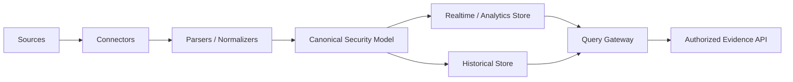

# Data Foundation Design

## 组件

### Connectors

处理认证、增量读取、断点续传、限流和源端错误，不进行威胁判断。

### Parsers and Normalizers

将源字段映射到进程、文件、网络、DNS、认证、持久化和资产等规范模型。解析失败记录必须进入隔离区并保留原因。

### Storage

实时层服务低延迟研判，历史层服务长时间回溯和基线计算。存储技术可替换，查询契约不应绑定具体引擎。

### Query Gateway

负责身份传递、Scope 下推、查询预算、分页、超时、Coverage 和审计。研判引擎不得直接连接底层存储。

## 与当前代码的兼容

现有 `EvidenceRepository.query(domain, evidence_types, state, parameters)` 可作为原型适配边界。生产化时应将案件状态从 Repository 参数中剥离，改为显式 `QueryContext`，并把租户身份、Scope 和分页令牌纳入契约。
