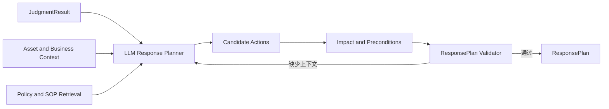

# Response Advisory Design

## 循环

## 设计原则

- 研判事实只读；处置紧迫性不能提升 Verdict。
- 候选动作先比较止损收益、业务影响、证据破坏风险和可逆性。
- 低风险建议可以自动生成；是否自动执行由 Case Governance 决定。
- 处置循环有独立预算和结束条件，避免反复检索相同政策。

## 结束条件

ResponsePlan 中每个动作均具有依据、目标、前置条件、影响、审批类别、回滚和验证步骤；无法补齐的信息进入 `missing_context` 和 `residual_risk`。
