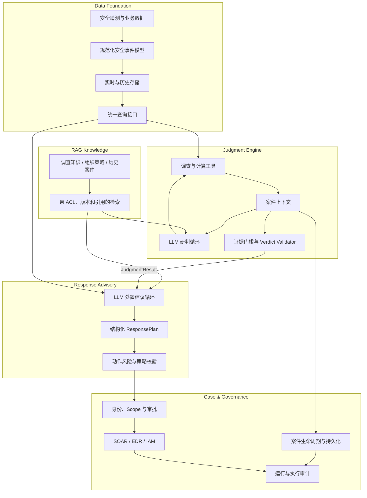

# Unknown-File Security Analysis Platform — Software Architecture

## 1. 架构结论

目标系统由五个 Feature 组成：安全数据底座、AI 研判引擎、AI 处置建议、RAG 知识能力和案件治理。LLM 是研判与处置建议的核心推理组件；确定性计算、证据模型和策略校验作为引擎内部的可信约束。处置建议与实际执行隔离。

当前代码已实现目标架构的本地可运行骨架：聚合调查数据 Port、JSONL/Fixture 适配器与 SQLite 参考数据存储，由案件父图挂载的 create_agent + middleware 研判循环及 LangGraph 处置建议子图，内存/SQLite Checkpoint、审批中断、稳定读模型、API 和页面。代码采用按能力纵向组织的模块化单体；RAG 仅保留接口与 Null Adapter，生产数据源、知识检索、身份系统和处置执行尚未接入。

## 2. 系统边界

系统负责：

- 从未知文件告警启动案件；
- 查询安全数据底座中的遥测和业务上下文；
- 形成可追溯的事实、发现、攻击路径和研判结论；
- 生成有条件、可回滚、可审批的处置建议；
- 使用受权限和版本控制的知识增强调查与处置；
- 保存案件、模型调用、工具调用、证据引用、审批和执行审计。

系统不负责替代 EDR、SIEM、数据湖或 SOAR 的底层能力，也不允许 LLM 绕过权限直接执行高风险处置。

## 3. 总体架构



## 4. 核心数据流

1. 告警进入案件治理模块并生成 `InitialCase`。
2. 研判引擎读取案件锚点，通过结构化工具查询数据底座。
3. 数据底座返回规范化事件和 Coverage；RAG 只返回知识，不返回案件事实。
4. LLM 形成假设并选择调查方向，确定性工具完成关联和计算。
5. Verdict Validator 形成 `JudgmentResult`，包括支持证据、反证、影响范围和限制。
6. 处置建议引擎读取 `JudgmentResult`，补充资产、业务和策略上下文，生成 `ResponsePlan`。
7. Policy 和人工审批决定动作是否进入执行系统；执行结果写回案件审计。

## 5. 关键边界

### 数据查询与 RAG

进程、文件、网络、身份和资产记录通过结构化查询获得；调查手册、组织 SOP、威胁知识和历史复盘通过 RAG 获得。RAG 文档不能单独证明当前案件发生了某个行为。

### 研判与处置

研判回答“发生了什么”；处置建议回答“应该怎么做”。处置循环不得修改已验证的 Fact、Finding 或 Verdict，只能基于风险采取更保守或更积极的建议。

### 建议与执行

LLM 只生成结构化建议。实际执行必须经过动作白名单、身份权限、风险分级、幂等检查和审批策略。

## 6. 当前实现映射

| 目标组件 | 当前实现 | 差距 |
|---|---|---|
| 数据底座 | `data_foundation`：`InvestigationDataPort`、JSONL/Fixture Adapter、SQLite 参考存储、Data Profile、Coverage | 参考存储不是生产数据湖；无生产连接器和数据级 RBAC |
| 研判引擎 | `judgment` + `agent_middleware`：create_agent 工具循环、边界、预算、压缩、报告接地 | 场景和规则仍集中注册，真实模型需部署配置 |
| RAG | `knowledge`：`KnowledgeRetrievalPort`、Null Adapter | 具体知识来源、索引、检索、ACL 和评测后置 |
| 处置建议 | `response_advisory`：原生子图、Response Policy、`ResponseContextPort`、参考资产上下文 | 无真实动作执行和组织策略知识 |
| 案件治理 | `case_management`：父图、内存/SQLite Checkpoint、interrupt、结果提交 | 无生产队列、身份系统、审计存储和执行集成；运行中任务尚不能在进程重启后续跑 |
| 输出展示 | `presentation`：案件及 L0～L3 对照读模型、只读 API、HTML 和契约序列化 | 当前为进程内读模型，未接生产读库；调查 API 仍是本地 Demo，未具备认证、RBAC 与受控事件展示边界 |

## 7. 代码组织与依赖方向

```text
src/threat_agent/
├── bootstrap/          # 配置、依赖组装和 CLI
├── contracts/          # 跨模块稳定 DTO，不依赖业务模块
├── case_management/    # 父图、审批、Checkpoint、结果提交
├── data_foundation/    # 证据查询端口与数据适配器
├── judgment/           # 研判 domain/application/ports/adapters
├── response_advisory/  # 处置 domain/application/ports/adapters
├── knowledge/          # RAG 端口与 Null Adapter
├── presentation/       # 只读 API、Store 和契约序列化
└── shared/             # ID、基础模型等无业务含义代码
```

依赖约束如下：

- `contracts` 和 `shared` 不依赖任何业务能力；
- `data_foundation` 不依赖案件、研判、处置或展示流程；
- `judgment` 只消费数据 Port，不直接依赖 SQLite 或外部安全平台 SDK；
- `presentation` 只消费稳定契约，不读取调查状态或 Checkpoint；
- 具体 Adapter 在 `bootstrap` 中组装，业务模块不依赖 `bootstrap`；
- 案件管理可以调用两个子图，两个子图之间只传递 `JudgmentResult`。

上述规则由 `tests/test_architecture_dependencies.py` 自动检查。

## 8. 后续演进

1. 用生产数据源适配器替换案件 JSONL，保持 `EvidenceQueryPort` 不变。
2. 将 Checkpoint、案件读模型、身份和审计迁入生产存储与服务。
3. 将 RAG 作为独立需求建设，替换 Null Adapter。
4. 在审批、幂等和补偿机制完备后接入处置执行系统。
5. 将场景、工具和判定规则逐步封装为可独立版本化的能力包。

## 9. 详细设计入口

- [Data Foundation](features/01-data-foundation/README.md)
- [Judgment Engine](features/02-judgment-engine/README.md)
- [Response Advisory](features/03-response-advisory/README.md)
- [RAG Knowledge](features/04-rag-knowledge/README.md)
- [Case Governance](features/05-case-governance/README.md)
- [Data-Driven Investigation Quality Demo](features/07-data-driven-investigation-quality-demo/README.md)
- [Architecture Decisions](shared/architecture-decisions.md)
