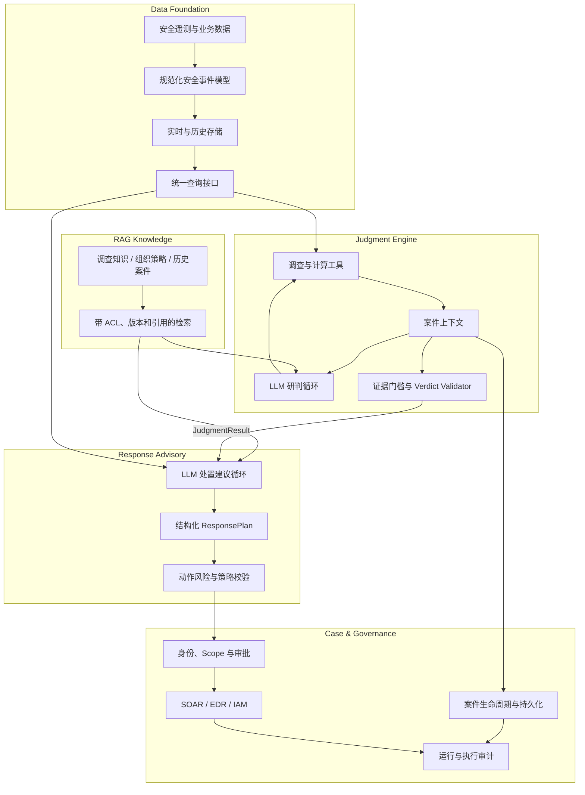

# Unknown-File Security Analysis Platform — Software Architecture

## 1. 架构结论

目标系统由五个 Feature 组成：安全数据底座、AI 研判引擎、AI 处置建议、RAG 知识能力和案件治理。LLM 是研判与处置建议的核心推理组件；确定性计算、证据模型和策略校验作为引擎内部的可信约束。处置建议与实际执行隔离。

当前代码只实现了案件级研判原型：从本地 JSONL 读取证据，在单进程内维护 `InvestigationState`，完成调查、确定性分析和报告。数据平台、处置建议循环、RAG、持久化案件管理和生产治理尚未实现。

## 2. 系统边界

系统负责：

- 从未知文件告警启动案件；
- 查询安全数据底座中的遥测和业务上下文；
- 形成可追溯的事实、发现、攻击路径和研判结论；
- 生成有条件、可回滚、可审批的处置建议；
- 使用受权限和版本控制的知识增强调查与处置；
- 保存案件、模型调用、工具调用、证据引用、审批和执行审计。

系统不负责替代 EDR、SIEM、数据湖或 SOAR 的底层能力，也不允许 LLM 绕过权限直接执行高风险处置。

## 3. 总体架构

## 4. 核心数据流

1. 告警进入案件治理模块并生成 `InitialCase`。
2. 研判引擎读取案件锚点，通过结构化工具查询数据底座。
3. 数据底座返回规范化事件和 Coverage；RAG 只返回知识，不返回案件事实。
4. LLM 形成假设并选择调查方向，确定性工具完成关联和计算。
5. Verdict Validator 形成 `JudgmentResult`，包括支持证据、反证、影响范围和限制。
6. 处置建议引擎读取 `JudgmentResult`，补充资产、业务和策略上下文，生成 `ResponsePlan`。
7. Policy 和人工审批决定动作是否进入执行系统；执行结果写回案件审计。

## 5. 关键边界

### 数据查询与 RAG

进程、文件、网络、身份和资产记录通过结构化查询获得；调查手册、组织 SOP、威胁知识和历史复盘通过 RAG 获得。RAG 文档不能单独证明当前案件发生了某个行为。

### 研判与处置

研判回答“发生了什么”；处置建议回答“应该怎么做”。处置循环不得修改已验证的 Fact、Finding 或 Verdict，只能基于风险采取更保守或更积极的建议。

### 建议与执行

LLM 只生成结构化建议。实际执行必须经过动作白名单、身份权限、风险分级、幂等检查和审批策略。

## 6. 当前实现映射

| 目标组件 | 当前实现 | 差距 |
|---|---|---|
| 数据底座 | `JsonlEventRepository`、Case JSONL | 无生产连接器、统一事件 Schema、历史查询和数据级 RBAC |
| 研判引擎 | `InvestigationEngine`、Planner、Analyzer、Policy、Verdict | 单进程、内存状态，场景和规则仍集中注册 |
| RAG | 无 | 无知识接入、检索、ACL、引用和评测 |
| 处置建议 | 无 | 当前系统只调查和报告 |
| 案件治理 | Scope、Budget、ToolCall 模型 | 无持久化、任务调度、人工审批服务和执行审计 |

## 7. 演进顺序

1. 冻结跨 Feature 契约和规范化数据模型。
2. 用真实数据底座适配器替换案件 JSONL，但保持研判引擎工具契约。
3. 持久化案件状态，支持暂停、恢复和人工补充。
4. 建设处置建议循环，先输出建议，不连接高风险自动执行。
5. 优先为处置策略建设 RAG，再为研判方法和历史案件提供检索。
6. 将场景、工具和判定规则逐步封装为可独立版本化的能力包。

## 8. 详细设计入口

- [Data Foundation](features/data-foundation/README.md)
- [Judgment Engine](features/judgment-engine/README.md)
- [Response Advisory](features/response-advisory/README.md)
- [RAG Knowledge](features/rag-knowledge/README.md)
- [Case Governance](features/case-governance/README.md)
- [Architecture Decisions](shared/architecture-decisions.md)
